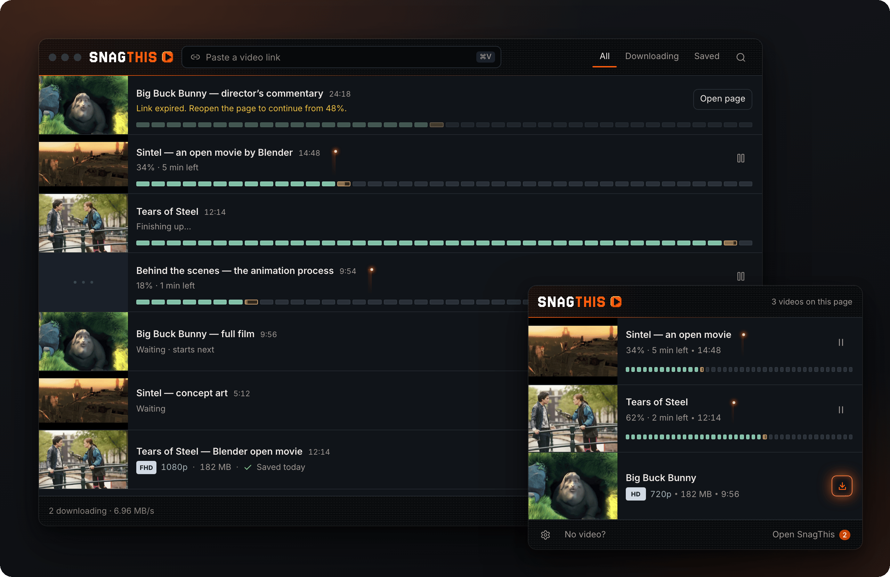
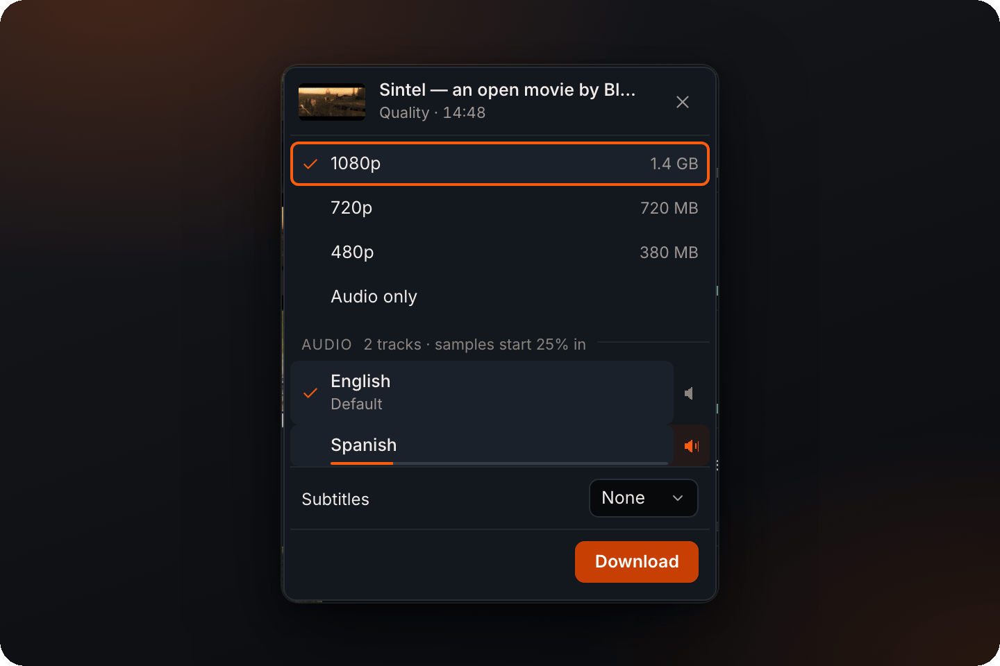
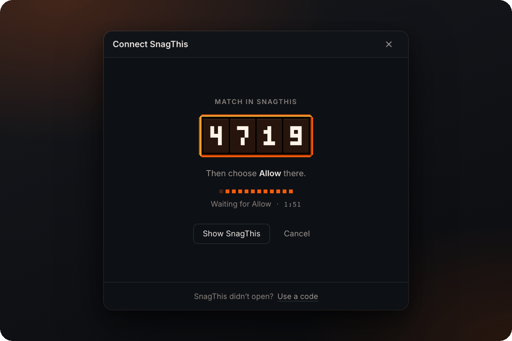
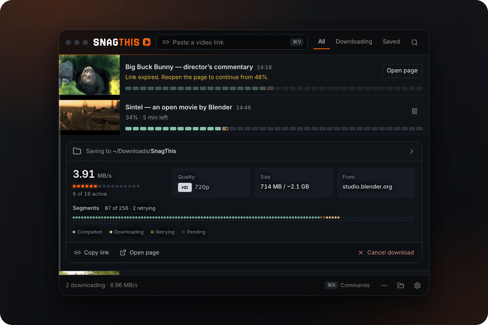
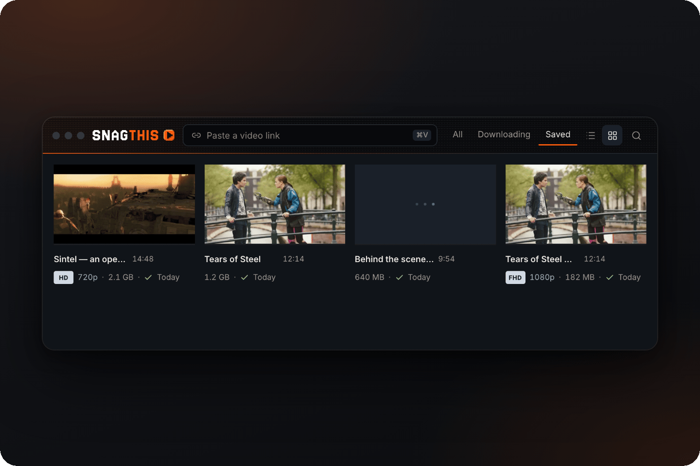
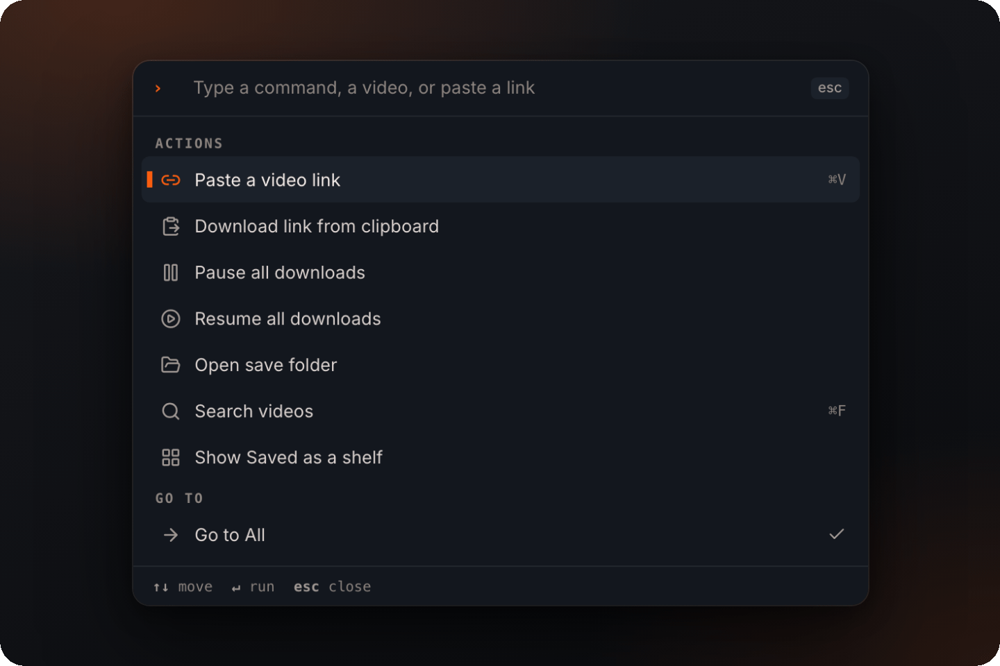
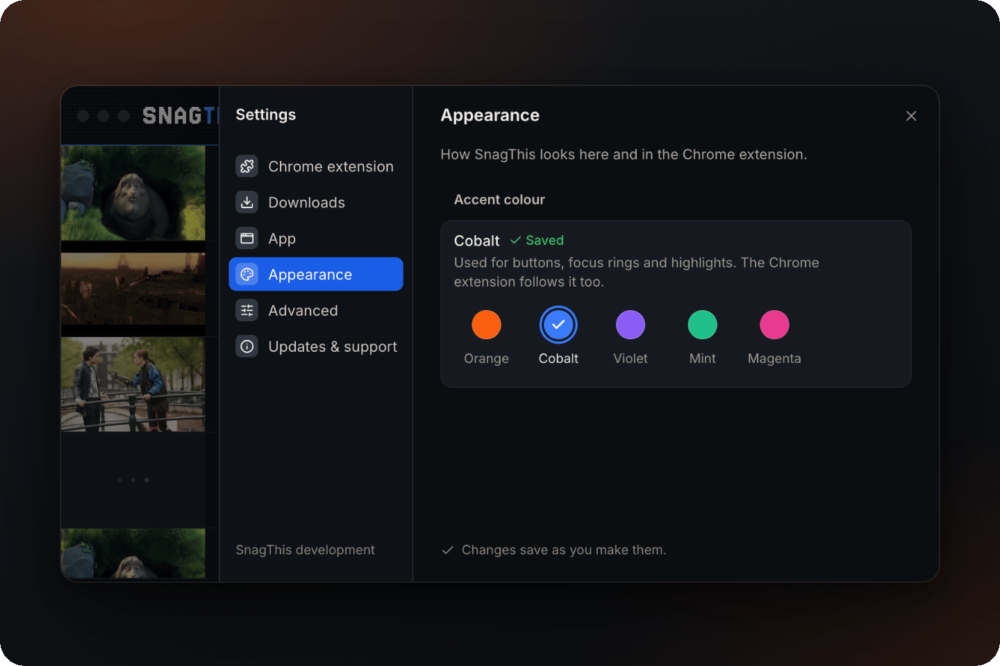

<p align="center">
  
</p>

<p align="center">
  <strong>Find a video in Chrome, pick the quality, and keep it.</strong><br>
  A Chrome extension and a desktop app that save supported web videos to your computer.
</p>

<p align="center">
  <a href="LICENSE"></a>
  
  
</p>

<p align="center">
  <a href="#features">Features</a> &nbsp;·&nbsp;
  <a href="#how-it-works">How it works</a> &nbsp;·&nbsp;
  <a href="#run-locally">Run locally</a> &nbsp;·&nbsp;
  <a href="#for-developers">For developers</a> &nbsp;·&nbsp;
  <a href="#troubleshooting">Troubleshooting</a>
</p>

> [!NOTE]
> **SnagThis hasn't launched yet.** This repository stays private until launch, and there are no public installers or Chrome Web Store listing so far. You can [run it locally](#run-locally) now. The website will be [snagthisvid.com](https://snagthisvid.com).

<p align="center">
  
</p>

## Features

<table>
  <tr>
    <td width="50%" valign="top">
      
      <p><strong>Choose quality, audio and subtitles.</strong> Each choice shows its size. Audio tracks get plain labels, and you can rest on one to hear a short sample before you pick.</p>
    </td>
    <td width="50%" valign="top">
      
      <p><strong>Connect with one click.</strong> Choose <em>Connect</em> in Chrome and approve it in the desktop app when both show the same four digits.</p>
    </td>
  </tr>
  <tr>
    <td width="50%" valign="top">
      
      <p><strong>Follow every download.</strong> Rows show segmented progress and a live speed trace. Open a row for speed, size, source and a map of every piece.</p>
    </td>
    <td width="50%" valign="top">
      
      <p><strong>Keep a Saved shelf.</strong> Finished videos stay in <em>Saved</em> as a list or a poster shelf. Hover over a poster to preview the video.</p>
    </td>
  </tr>
  <tr>
    <td width="50%" valign="top">
      
      <p><strong>Use the keyboard.</strong> Press <kbd>⌘</kbd> <kbd>K</kbd> (<kbd>Ctrl</kbd> <kbd>K</kbd> on Windows) to run commands, find a video or paste a link.</p>
    </td>
    <td width="50%" valign="top">
      
      <p><strong>Pick your colour.</strong> Choose from five accent colours. The Chrome extension uses the same one.</p>
    </td>
  </tr>
</table>

To add a link in the desktop app, paste it into the header, press <kbd>⌘</kbd> <kbd>V</kbd>, or drop it on the window.

## See it in action

<table>
  <tr>
    <th width="61%">Desktop app</th>
    <th width="39%">Chrome extension</th>
  </tr>
  <tr>
    <td valign="top"></td>
    <td valign="top"></td>
  </tr>
</table>

<sub>Recorded from the real interfaces using their built-in sample data. No live sites or accounts appear. Stills: <a href="docs/images/desktop.png">desktop</a> · <a href="docs/images/chrome-extension.png">extension</a>. Sample films by the Blender Foundation; see <a href="apps/desktop/src/dev/media/CREDITS.md">credits and licenses</a>.</sub>

## How it works

1. **Play the video** on a supported website, then click SnagThis in Chrome's toolbar.
2. **Choose what to keep.** Pick the quality, plus audio and subtitles when the site offers them.
3. **Download and carry on.** Downloads keep going after you close the popup.

### Chrome alone or with the desktop app

The extension works on its own for simple files. For everything else, it sends the download to the desktop app.

| | Chrome extension only | With the desktop app |
| --- | :---: | :---: |
| Direct **MP4 and WebM** files | ✓ | ✓ |
| **HLS and DASH** streams | | ✓ |
| Separate audio tracks, subtitles and video processing | | ✓ |
| Links pasted or dropped in, and supported page links | | ✓ |
| Where files go | Chrome Downloads | Your SnagThis folder and the **Saved** shelf |
| Setup | None | [Connect once](#connect-the-desktop-app) |

Keep the desktop app open while it's downloading. To send a direct file to the desktop app instead of Chrome Downloads, right-click its row in the popup and choose **Download with desktop**.

> [!IMPORTANT]
> Only save videos you own or have permission to save. SnagThis detects DRM-protected video and refuses it; it never captures, decrypts or records protected media. Live recording isn't supported. See the [compatibility notes](compat/COMPATIBILITY.md) for tested formats and sites.

## Getting SnagThis

| | Status |
| --- | --- |
| **Desktop app** (macOS and Windows) | Planned on this repository's [GitHub Releases](https://github.com/dylansallred/snagthis/releases): notarized for macOS and signed through Azure Artifact Signing for Windows, with automatic updates. |
| **Chrome extension** | Chrome Web Store listing planned. A ZIP from GitHub Releases is the fallback; ZIP installs have to be updated by hand ([extension guide](docs/extension-release.md)). |

Until then, run it from a local checkout.

## Run locally

You'll need Git, Chrome and the Node.js version pinned in [`.nvmrc`](.nvmrc) (22.x).

```sh
nvm install && nvm use
npm ci
npm run build:extension:css
```

**Load the extension:** open `chrome://extensions`, turn on **Developer mode**, choose **Load unpacked** and select the **`apps/extension`** folder. Direct MP4 and WebM downloads work straight away.

<details>
<summary><strong>Run the desktop app too</strong></summary>

<br>

The desktop app uses FFmpeg and FFprobe to process video, and yt-dlp for supported page links. Fetch the pinned builds into `apps/desktop/bin`:

```sh
npm run fetch:ffmpeg --workspace @m3u8/desktop
npm run fetch:yt-dlp --workspace @m3u8/desktop   # optional, for page links
```

Or put your own copies on `PATH`, or set `FFMPEG_PATH`, `FFPROBE_PATH` and `YTDLP_PATH`. Then start the app:

```sh
npm run dev
```

</details>

### Connect the desktop app

You only need to do this once, and only for downloads that use the desktop app.

1. With the desktop app running, open **Extensions → SnagThis** in Chrome and choose **Connect**.
2. SnagThis comes forward with four digits. If Chrome shows the same four, choose **Allow**. The connection is saved on your computer.

<details>
<summary>SnagThis didn't come forward, or you're connecting another browser?</summary>

<br>

Choose **Use a code instead** in the popup. In the desktop app, open **Settings → Chrome extension → Show connection code** and paste the six-digit code into Chrome. Codes expire after five minutes. Each browser gets its own key, and **Disconnect** in either app removes it.

</details>

## For developers

| Command | What it does |
| --- | --- |
| `npm run dev` | Desktop app in development (Vite renderer + Electron) |
| `npm run dev:extension:css` | Rebuild the extension's CSS on change |
| `npm run sync:extension` | Copy shared modules from `packages/contracts` into the extension |
| `npm run verify` | Lint, desktop typecheck, tests, both builds and token parity — run before a PR |
| `npm test` | Unit, integration and media tests |
| `npm run test:e2e` | Playwright browser and Electron checks |
| `npm run package:extension` | Build the extension ZIP |
| `npm run compat` | Run the site compatibility survey |

<details>
<summary><strong>Repository layout</strong></summary>

<br>

| Path | Contents |
| --- | --- |
| `apps/desktop/src` | Desktop renderer (React, TypeScript) |
| `apps/desktop/electron` | Electron main and preload |
| `apps/extension` | Chrome MV3 extension (popup, service worker, content scripts) |
| `packages/downloader-api` | Local bridge between the extension and the desktop app |
| `packages/downloader-engine` | Media engine |
| `packages/contracts` | Shared display state, strings and parsers |
| `compat` | Compatibility notes, survey and results |
| `docs` | [Design spec](docs/design/ui-design-spec.md), [release readiness](docs/release-readiness.md), [release guide](docs/release-guide.md) |

Read [AGENTS.md](AGENTS.md) and [CONTRIBUTING.md](CONTRIBUTING.md) before changing things.

</details>

<details>
<summary><strong>Preview the interfaces with sample data</strong></summary>

<br>

Both interfaces have development galleries that need no browser session or desktop backend:

```sh
cd apps/desktop && npx vite --port 5173 --strictPort   # http://localhost:5173/?gallery
npx http-server apps/extension -p 5174 -s              # http://localhost:5174/popup.html?demo
```

Try `?gallery=states`, `?gallery=empty`, `?gallery&picker`, `?gallery&palette` or `?gallery&sheet=settings`, and `?demo=quality`, `?demo=audio`, `?demo=snag`, `?demo=pairing` or `?demo=settings`. With both running, `node scripts/capture-readme-media.cjs` regenerates the images in this README.

</details>

## Your files stay yours

Downloads and video processing happen on your computer. There's no account, telemetry, paid tier or download quota.

- Chrome uses your usual download settings; the desktop app has its own save folder.
- Removing a video from the desktop list keeps its file. **Moving the file to Trash is a separate choice.**
- The extension needs website access to find videos and Chrome's downloads permission to save direct files. Downloads connect straight to the source; update checks and optional services have their own connections.

Read the [privacy details](PRIVACY.md).

## Troubleshooting

| What you see | What to try |
| --- | --- |
| **No video found** | Start playback, reopen SnagThis, or choose **No video?** in the popup. |
| **App not open** | Start the desktop app. If asked to connect, follow [Connect the desktop app](#connect-the-desktop-app). Direct Chrome downloads don't need it. |
| **Link expired** | Reopen the source page, play the video, and open SnagThis again to continue from where it stopped. |
| **Download failed** | Read the message in the popup or in Chrome Downloads. For desktop downloads, open the row for details. |
| **Protected video** | DRM-protected video can't be saved. This is intentional. |

<details>
<summary><strong>Reporting a bug</strong></summary>

<br>

Say what you clicked and what error you saw. Check diagnostics before sharing them, and keep cookies, tokens and private video links out of public issues. Report security concerns through [SECURITY.md](SECURITY.md).

</details>

---

<p align="center">
  <a href="CONTRIBUTING.md">Contribute</a> &nbsp;·&nbsp;
  <a href="docs/release-guide.md">Desktop releases</a> &nbsp;·&nbsp;
  <a href="docs/extension-release.md">Extension releases</a> &nbsp;·&nbsp;
  <a href="compat/COMPATIBILITY.md">Compatibility</a> &nbsp;·&nbsp;
  <a href="PRIVACY.md">Privacy</a> &nbsp;·&nbsp;
  <a href="LICENSE">GPL-3.0-only</a>
</p>

<p align="center"><sub>Sample films in the screenshots: <em>Sintel</em>, <em>Big Buck Bunny</em> and <em>Tears of Steel</em>, © Blender Foundation, CC BY 3.0 (<a href="apps/desktop/src/dev/media/CREDITS.md">credits</a>). No endorsement is implied. Third-party dependencies keep their own licenses; see <a href="THIRD_PARTY_NOTICES.md">third-party notices</a>.</sub></p>
