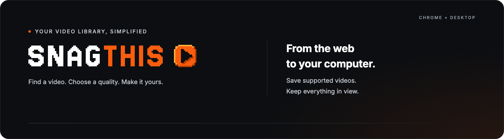
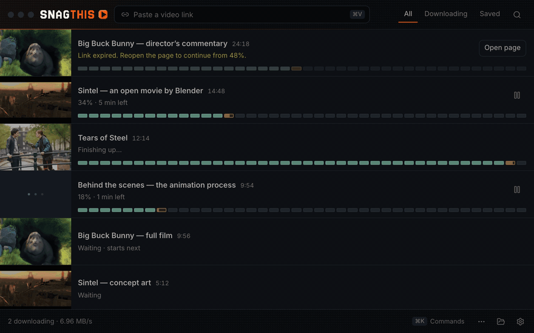
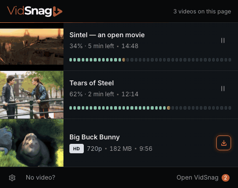

<p align="center">
  
</p>

<p align="center">
  <strong>A simple home for your video downloads.</strong><br>
  Find a video in Chrome, choose the quality, and save it to your computer.
</p>

<p align="center">
  <a href="#see-it-in-action">See it in action</a> &nbsp;·&nbsp;
  <a href="#get-started">Get started</a> &nbsp;·&nbsp;
  <a href="#connect-the-desktop-app">Connect the desktop app</a> &nbsp;·&nbsp;
  <a href="#need-a-hand">Need a hand?</a>
</p>

> [!NOTE]
> **SnagThis is in development.** Public installers and a Chrome Web Store listing are not available yet. You can [run it locally](#get-started) today.

## See it in action

<table>
  <tr>
    <th width="67%">Your downloads, together</th>
    <th width="33%">Right there in Chrome</th>
  </tr>
  <tr>
    <td valign="top"><a href="docs/images/desktop-demo.gif"></a></td>
    <td valign="top"><a href="docs/images/extension-demo.gif"></a></td>
  </tr>
  <tr>
    <td>Preview your videos, follow progress, and keep your saved files in one place.</td>
    <td>Find videos on the current page and start a download without leaving Chrome.</td>
  </tr>
</table>

<sub>Recorded from the real interfaces with sample download states. Click an animation to enlarge it. Prefer still images? View the <a href="docs/images/desktop.png">desktop</a> or <a href="docs/images/chrome-extension.png">extension</a>. Sample films by the Blender Foundation; <a href="apps/desktop/src/dev/media/CREDITS.md">credits and licenses</a>.</sub>

## From playing to saved

1. **Play a video** on a supported website, then open SnagThis in Chrome.
2. **Choose the quality** when the source offers alternatives. Available audio and subtitle choices appear with it.
3. **Download and carry on.** Downloads keep going after you close the popup.

You can also paste a video link directly into the desktop app.

| In Chrome | With the desktop app |
| --- | --- |
| Save supported direct **MP4 and WebM** files | Download **HLS and DASH streams** and supported page links |
| No pairing or desktop app required | Handle separate audio, subtitles, and video processing |
| Files appear in **Chrome Downloads** | Keep finished downloads in a **Saved** library |

Keep the desktop app open for downloads that use it. To send a direct file to its library instead of Chrome Downloads, right-click the video's row and choose **Download with desktop**. Browser-only stream downloading is not available yet.

Use SnagThis for videos you own or have permission to save. Protected DRM videos and live recording are not supported. See the [compatibility notes](compat/COMPATIBILITY.md) for tested formats and sites.

## Get started

The planned release channels are the **Chrome Web Store** and desktop installers on **this repository's GitHub Releases**. If a Store release is unavailable, we'll provide an extension ZIP to load manually. ZIP installations require manual updates; see the [extension guide](docs/extension-release.md).

For now, run the prerelease from a local checkout. You'll need Git, Node.js, and npm. Use the Node version pinned in `.nvmrc`:

```sh
nvm install
nvm use
npm ci
npm run build:extension:css
```

In Chrome, open `chrome://extensions`, enable **Developer mode**, choose **Load unpacked**, and select this repository's **`apps/extension`** folder. Direct MP4 and WebM downloads are ready to try.

<details>
<summary><strong>Run the desktop app too</strong></summary>

Install FFmpeg and FFprobe for video processing, plus optional yt-dlp for supported page-link downloads. Make these tools available on your PATH, or set `FFMPEG_PATH`, `FFPROBE_PATH`, and `YTDLP_PATH`.

Then start the app:

```sh
npm run dev
```

Connect it to Chrome using the steps below.

</details>

### Connect the desktop app

Connect once for downloads that need the desktop app. Direct Chrome downloads don't need this step.

1. With SnagThis desktop running, open **Extensions → SnagThis** in Chrome and choose **Connect**.
2. SnagThis comes forward with four digits. If Chrome shows the same four, choose **Allow**. The connection stays saved on your device.

If SnagThis doesn't come forward, or you are connecting another browser, choose **Use a code instead**: open **Settings → Chrome extension → Show connection code** in the desktop app and paste the six-digit code in Chrome. Codes expire after five minutes. Each browser gets its own key; **Disconnect** in either app removes it.

## Your files stay yours

Downloads and video processing happen on your computer. There's no required account, telemetry service, paid tier, or artificial download quota.

Chrome uses your usual download settings; the desktop app has its own save folder. Removing a video from the desktop list keeps its file. **Moving the file to Trash is a separate choice.**

The extension needs website access to find videos and Chrome's downloads permission to save direct files. Downloads contact the source directly; optional services and update checks have their own connections. Read the [privacy details](PRIVACY.md).

## Need a hand?

| What you're seeing | What to try |
| --- | --- |
| **No video found** | Start playback, reopen SnagThis, or choose **No video?** in the popup. |
| **App not open** | Start the desktop app. If asked to connect, use a fresh code from **Settings → Chrome extension**. Direct Chrome downloads don't require it. |
| **Download failed** | Check the message in the popup or **Chrome Downloads**. For desktop downloads, open **Details**. If the link expired, reopen the source page and try again. |

When reporting a bug, include what you clicked and the error you saw. Review diagnostics first and keep cookies, tokens, and private video links out of public issues. Report security concerns through [SECURITY.md](SECURITY.md).

---

<p align="center">
  <a href="CONTRIBUTING.md">Contribute</a> &nbsp;·&nbsp;
  <a href="docs/release-guide.md">Desktop releases</a> &nbsp;·&nbsp;
  <a href="docs/extension-release.md">Extension releases</a> &nbsp;·&nbsp;
  <a href="PRIVACY.md">Privacy</a> &nbsp;·&nbsp;
  <a href="LICENSE">GPL-3.0-only</a>
</p>

<p align="center"><sub>Third-party dependencies and sample media retain their own licenses. See <a href="THIRD_PARTY_NOTICES.md">third-party notices</a>.</sub></p>
