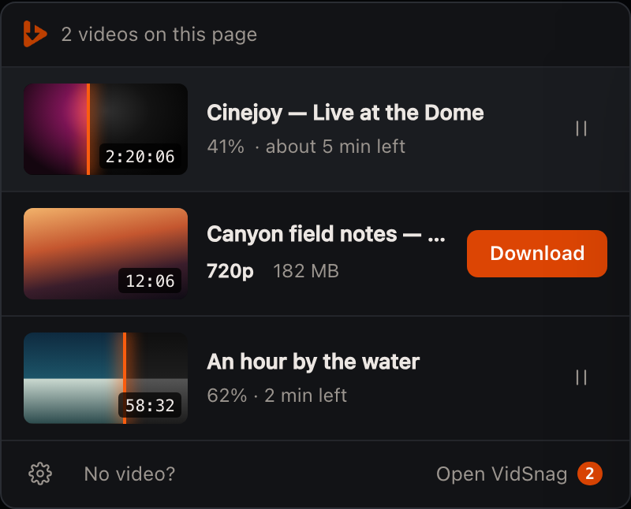
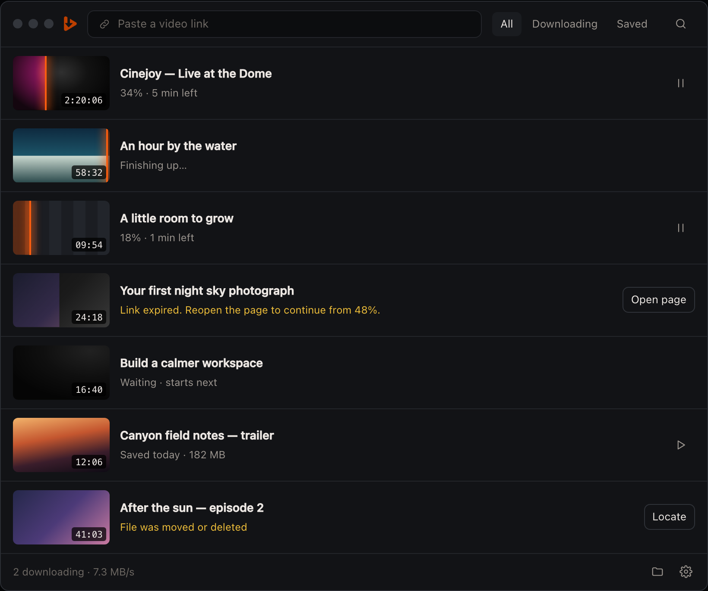
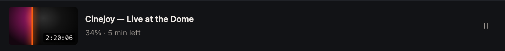
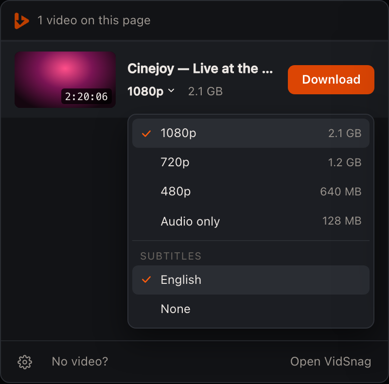
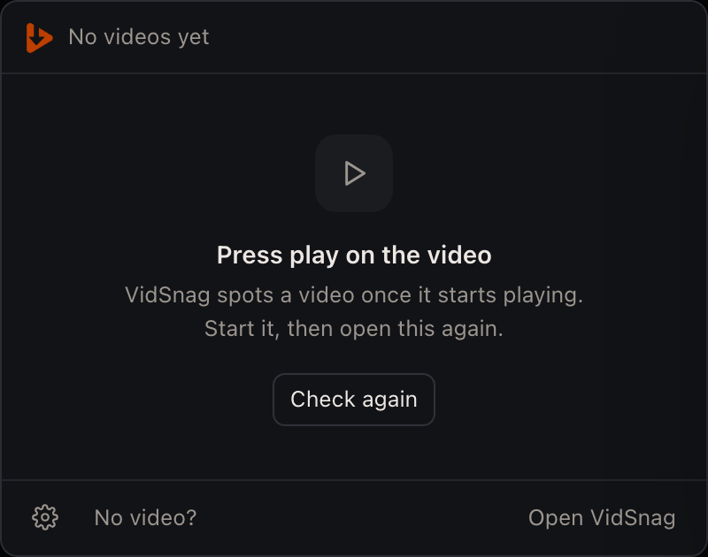
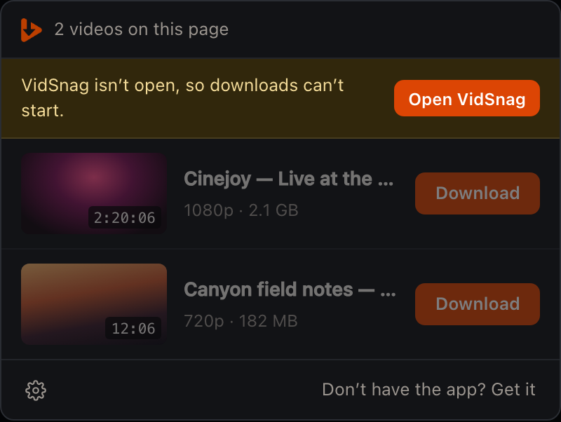
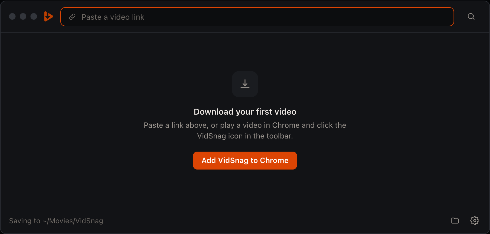
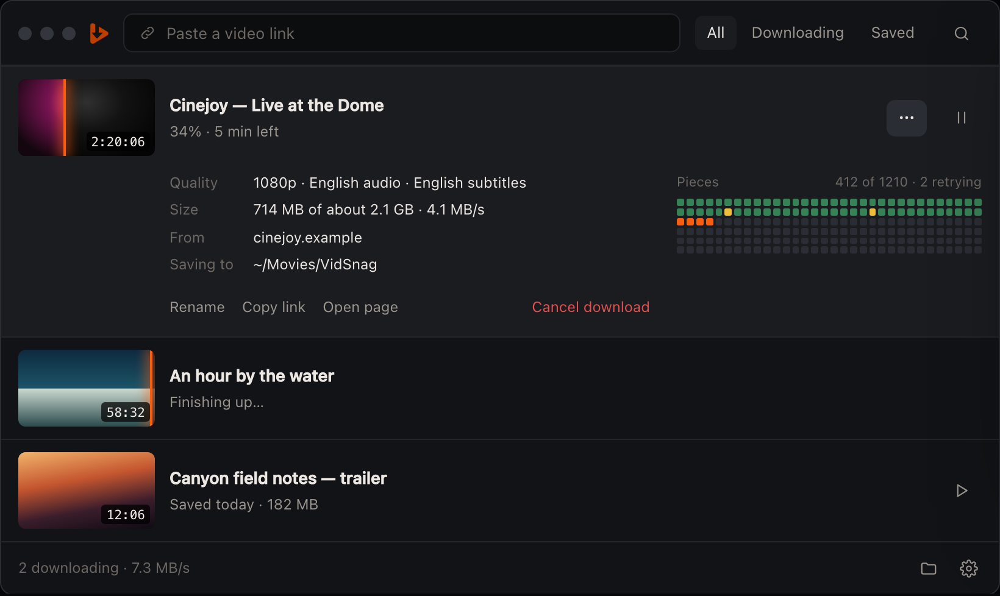
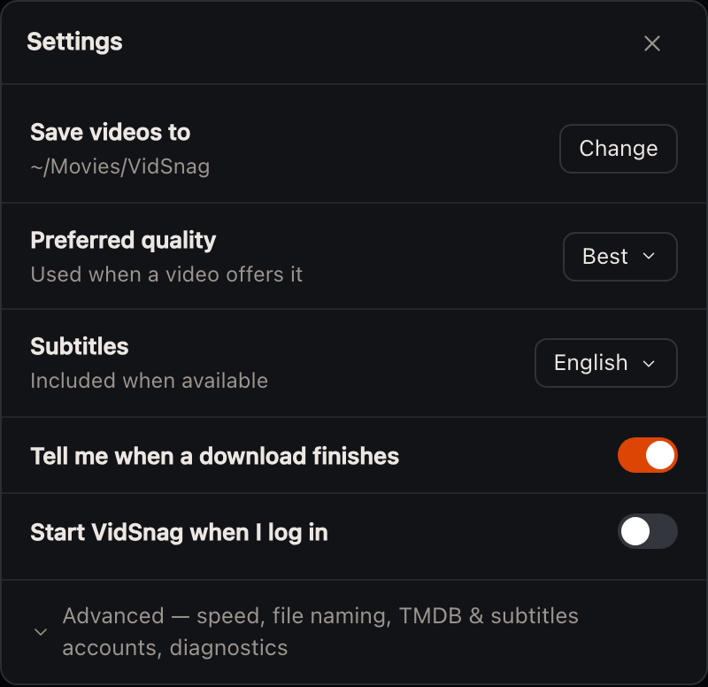

# VidSnag UI design spec — "Workbench, simplified"

Status: approved direction, updated by the owner on 2026-09-19: clean hover/focus video thumbnails, duration beside the title, and progress on the row background. The owner selected **A+B: Leading edge + Soft sweep** from the interactive concepts. Applies to the Chrome popup (`apps/extension`) and the desktop app (`apps/desktop`).
Companion: [roadmap.md](roadmap.md). Interactive mock-ups: [mockups/main-screens.html](mockups/main-screens.html), [mockups/states.html](mockups/states.html) (open in a browser; sample data, nothing is downloaded).

| Popup | Desktop |
|---|---|
|  |  |

## 1. Principles

1. **One row, four things.** Every video is a row of: thumbnail, title, one quiet status line, one visible action. Nothing else is visible at rest.
2. **Keep the video clear.** Progress belongs on the row background. The thumbnail shows a full-colour poster or a silent loop on hover/focus; duration sits beside the title.
3. **Same row everywhere.** The popup and the desktop render the same row component with the same states and copy.
4. **Extras are one step away, never zero.** Quality/subtitles live in a menu; rename, remove, copy link, technical detail live in "⋯" / right-click; settings beyond five rows live under Advanced.
5. **Plain words.** No HLS / M3U8 / MP4 / segment / thread / port in the default UI. "Pieces" is the only word used for segments, and only inside details.
6. **Silence when healthy.** Connection state, errors and counts only appear when they need the user. Problems are one amber sentence + one labelled button.
7. **Orange means "act" or "moving".** Primary button, row progress, focus ring. Nothing decorative is orange.

How we got here: the first concepts (Ember/Focus/Cinema) were rejected as generic; a dense variant (A+) was "too much going on"; a middle variant was tried and the user preferred the simple one. When in doubt, remove.

## 2. Design tokens

Reuse the existing tokens in `apps/desktop/src/globals.css`; the extension's `src/input.css` must define the same names and values (single source of truth: copy the `@theme` block, do not fork values).

| Role | Token | Value today | Used for |
|---|---|---|---|
| Window surface | `--color-background-raised` | `hsl(222 14% 8%)` | popup body, desktop window |
| Row hover / open detail | `--color-background-hover` | `hsl(222 12% 11%)` | `.row:hover`, expanded detail |
| Control hover | `--color-background-active` | `hsl(222 12% 13%)` | icon button hover, menu item hover |
| Inset field | `--color-background` | `hsl(222 16% 6%)` | paste field |
| Divider | `--color-border-subtle` | `hsl(221 8% 12%)` | 1px line between rows, header/footer |
| Control border | `--color-border` | `hsl(221 10% 18%)` | labelled secondary button, menus, settings values |
| Text | `--color-foreground` | `hsl(20 20% 93%)` | titles, values |
| Muted text | `--color-foreground-muted` | `hsl(20 6% 60%)` | status line, icon buttons |
| Subtle text | `--color-foreground-subtle` | `hsl(20 5% 44%)` | placeholders, footer summary |
| Primary | `--color-primary` | `hsl(18 96% 44%)` | Download button, count badge |
| Primary hover / scan-line | new `--color-primary-hover` | `hsl(20 96% 52%)` | button hover, scan-line, focus ring |
| Attention | `--color-status-paused` | `hsl(44 84% 58%)` | the amber sentence |
| Success | `--color-status-completed` | `hsl(145 62% 46%)` | "Saved" in popup after finishing |
| Destructive | `--color-destructive` | `hsl(0 72% 56%)` | "Cancel download", "Move to Trash" text only |

Typography: Inter. Title 13.5px / 570 weight, single line, ellipsis. Status line 12px muted. Buttons 12.5px / 600. Duration chip 10.5px mono on `rgba(0,0,0,.72)`. No other mono text in default UI.

Radii: thumbnail 6px, buttons 7px, menus 9px, window 10px. Spacing unit 2px; row padding `10px 14px`, gap 12px.

Status colours `--color-status-queued/downloading/failed/cancelled` and all `--color-segment-*` remain defined but are only used inside the details panel.

## 3. The row



```
┌──────────┐  Title, one line, ellipsis                         [⋯ hover] [ action ]
│ thumb    │  Status line, one line, muted
└──────────┘
```

| Part | Popup (400px wide) | Desktop (min 640px, designed at 820px) |
|---|---|---|
| Thumbnail | 104 × 58 | 112 × 63 |
| Row height | 78 | 83 |
| Visible action | right-aligned, 30px high | same |
| Hover extras | none (right-click menu) | "⋯" appears left of the action; saved rows also show folder |
| Divider | 1px `border-subtle` on top of every row except the first | same |

Rules:
- Exactly **one** visible action per row. If a state has no sensible action (e.g. "Finishing up…", "Waiting"), show none.
- Rows have no border, background or shadow at rest. Hover = `background-hover`.
- Whole row is a click target on desktop: click toggles the details panel (§7). In the popup rows are not clickable.
- Right-click anywhere on a row opens the same menu as "⋯".

### 3.1 Row states — copy and action

`QueueJob` fields referenced are from `apps/desktop/src/types/queue.ts`.

| State | Condition | Status line | Thumbnail | Visible action | Hover / ⋯ |
|---|---|---|---|---|---|
| Detected (popup only) | media item not yet sent | `[1080p ⌄]  2.1 GB` (quality is a text-button, §5) | full colour | **Download** (primary) | right-click: Rename, Hide |
| Waiting | `queueStatus = queued` | `Waiting` or `Waiting · starts next` (first in queue) | full-colour poster/preview | none | ⋯: Start now, Move up, Remove |
| Downloading | `queueStatus = downloading`, not finalizing | `{pct}% · {eta}` | full-colour poster/preview | Pause (icon) | ⋯ |
| Finishing | downloading and `status` indicates remux/convert/verify | `Finishing up…` | full-colour poster/preview | none | ⋯ |
| Paused by user | `queueStatus = paused` | `Paused at {pct}%` | full-colour poster/preview | Resume (play icon) | ⋯ |
| Needs the user | `failed` with recoverable cause | amber sentence (§3.3) | full-colour poster/preview | labelled button (bordered) | ⋯ |
| Saved | history item / `completed` | `Saved {when} · {size}` | full colour | Play (icon) | folder, ⋯ |
| Saved, file missing | file not on disk | amber `File was moved or deleted` | full colour | **Locate** (bordered) | ⋯: Remove from list |
| Popup, just finished | job completed while popup open | green `Saved` | full colour | **Play** (bordered) | — |

`cancelled` jobs are removed from the list immediately (toast: "Download cancelled · Undo" for 5 s). They never render as rows.

### 3.2 Formatting

| Value | Rule | Examples |
|---|---|---|
| `{pct}` | `Math.floor(progress)`; never show 100% (switch to Finishing) | `34%` |
| `{eta}` | from `etaSeconds`. `<60` → `under a minute left`; `<3600` → `{m} min left`; else `{h} hr {m} min left`; `null`/unknown → omit the ` · {eta}` part entirely | `5 min left` |
| `{size}` | 1 decimal for GB, integer for MB; unknown → omit; estimates are prefixed `about` only inside menus/details | `182 MB`, `2.1 GB` |
| `{when}` | `today`, `yesterday`, weekday within 7 days, else `12 Sep` | `Saved today · 182 MB` |
| Duration chip | `m:ss` or `h:mm:ss`; hidden when unknown | `2:20:06` |
| Speed | never in rows. Total speed in desktop footer; per-job speed in details | `7.3 MB/s` |

### 3.3 Problem sentences

One sentence, amber, ends with a full stop only if it contains two clauses. One labelled button.

| Cause (map from `job.error` classification) | Sentence | Button |
|---|---|---|
| Source URL expired / 403 / 410 on manifest | `Link expired. Reopen the page to continue from {pct}%.` | Open page |
| Network unreachable / retries exhausted | `Connection lost at {pct}%` | Try again |
| Disk full / not writable | `Not enough space in {folder}` | Choose folder |
| Unsupported / DRM | `This video can't be downloaded` | Details |
| Output file missing | `File was moved or deleted` | Locate |
| Anything else | `Something went wrong at {pct}%` | Try again |

Raw error text is only shown in the details panel.

## 4. Video thumbnails and row progress

The owner replaced the original colour-fill thumbnail on 2026-09-19. Earlier screenshots and mock-ups record the previous design; they do not override this revision.

- Show one unobscured full-colour poster, or a silent real video excerpt. No grayscale mask, progress clipping, scan-line or duration badge belongs inside the thumbnail.
- A roughly ten-second clip loops only while the row is hovered or has keyboard focus. Stop when focus/pointer leaves, the page is hidden or the row is removed. Respect reduced motion by retaining the still poster.
- Put video duration beside the title. It must remain readable without squeezing the title out at popup width.
- Retain the poster while a clip is unavailable, being generated or fails to play. Produce clips from playable downloaded media; detecting a source alone does not guarantee a clip is available.
- Drive row background progress from actual `job.progress`, with the existing status sentence and accessible progress value. Pause motion while paused or waiting. Motion may indicate activity, but must never invent progress.
- Use the selected **A+B** treatment: a subdued warm fill, a moving glint along its progress edge, and a slow wash of light within the downloaded area. Both surfaces use the same colours and timing. Keep all motion behind the row content. The [interactive motion comparison](prototypes/download-motion/index.html) records the choice using licensed demo excerpts and simulated progress.
- Do not put “Preview,” clip-length labels or other hover text over the video. Accessible labels may describe the preview without occupying video space.
- Thumbnail source priority remains job/YouTube/history poster, page poster, early frame grab, then neutral placeholder. Poster updates must not reset download progress.

## 5. Popup (`apps/extension`)

Width 400px. Max height 560px; the list scrolls, header and footer are fixed.

```
┌ header ─ logo · "{n} videos on this page"                         ┐
│ [banner — only when the desktop app is unreachable]               │
│ rows…                                                             │
└ footer ─ ⚙ · "No video?"                     "Open VidSnag" (n)  ┘
```

| Element | Spec |
|---|---|
| Header text | `No videos yet` / `1 video on this page` / `{n} videos on this page`. No connection indicator when healthy. |
| Footer left | Settings (gear icon, opens the settings sheet §8), `No video?` (opens help: the empty-state text + link to troubleshooting). |
| Footer right | `Open VidSnag` → `POST /v1/app/focus`. Orange count badge = jobs currently downloading or waiting (from `GET /v1/queue`). Hidden when 0. |
| Removed from today's popup | "Bridge" pill, "Detected Media" heading, refresh icon (auto-refresh on open), "Clear Media" button (replaced by per-row Hide in right-click; list resets on navigation), API host:port text, type/resolution pills, hostname + content-type row, Stream button (moved to right-click → "Preview"). |

### 5.1 Download flow

1. Click **Download** → button shows a spinner for the POST (`/v1/jobs`), max 300ms before optimistic switch.
2. Row switches to Downloading: status `0%`, row progress begins while the thumbnail stays clear. No toast.
3. Popup keeps the mapping `mediaItemId → jobId` in `chrome.storage.session` so reopening the popup shows the same row in its live state.
4. Progress comes from polling `GET /v1/queue` every 1s while the popup is open (WebSocket is unnecessary for a short-lived popup).
5. On completion: green `Saved` + **Play** (opens the file via the desktop app). On reopen after completion the row returns to Detected only if the page is reloaded.

Closing the popup never affects the download.

### 5.2 Quality menu



- Trigger: the quality text-button in the status line (`1080p ⌄`). Shown only when more than one real variant was discovered; otherwise plain text (`720p`) or nothing.
- Default selection: user's Preferred quality setting (default "Best"), falling back to the highest available.
- Items: one per discovered variant, highest first: label `{height}p`, right-aligned size (`about` omitted here for width; sizes are estimates = bandwidth × duration ÷ 8 when not known). `Audio only` last, only if an audio rendition exists.
- Second group `Subtitles`, only if subtitle renditions exist: languages, then `None`.
- Menu is a popover anchored under the status line, 250px wide, inside the popup bounds; keyboard: ↑/↓, Enter, Esc; `role="menu"` with `menuitemradio`.
- Duplicate detections (master playlist + its variant playlists, same video as HLS and MP4) must collapse into **one row**; the alternatives become menu items. Collapse only when the variant URL is listed in the master playlist, or duration and page match exactly; never on filename similarity alone. Escape hatch: right-click a row → `Show all detected streams` expands the collapsed items as separate rows for that page visit.

### 5.3 Popup thumbnails

Order: YouTube metadata thumbnail → `<video poster>` → `og:image` / `twitter:image` of the page → canvas frame grab from the playing `<video>` (content script; skip silently if the canvas is tainted) → placeholder. Captured by the content script at detection time, stored with the media item as a URL or a ≤ 20 KB JPEG data URL (208×116).

### 5.4 Popup states

| State | Spec |
|---|---|
| Nothing found  | Icon tile, `Press play on the video`, `VidSnag spots a video once it starts playing. Start it, then open this again.`, bordered **Check again**. |
| Desktop app unreachable  | Amber banner under the header: `VidSnag isn't open, so downloads can't start.` + primary **Open VidSnag** (new `vidsnag://open` protocol handler — does not exist yet, roadmap M2; if the health check still fails after 3s, swap the button to `Get the app`). Rows at 45% opacity, not clickable. Footer right becomes `Don't have the app? Get it`. Poll `/v1/health` every 2s; on success remove the banner without reload. |
| Extension/app version mismatch | Same banner pattern: `Update VidSnag to keep downloading.` + **Update**. |

## 6. Desktop (`apps/desktop`)

One window, one list. Minimum 640 × 480; designed at 820 wide.

```
┌ top bar ─ ●●● logo [ Paste a video link            ] All · Downloading · Saved   🔍 ┐
│ rows (unified: active + waiting + problems + saved)                                  │
└ footer ─ "2 downloading · 7.3 MB/s"                                        📁   ⚙   ┘
```

| Element | Spec |
|---|---|
| Navigation | The Navbar with Queue / History / Settings is **removed**. Queue and History merge into one list; Settings becomes a sheet (§8). |
| Paste field | Always visible. Placeholder `Paste a video link`. ⌘V anywhere in the window with a URL on the clipboard focuses and fills it. Enter submits. While resolving: inline spinner + `Checking link…`; on success the field clears and the new row appears at the top of its group; on failure the field shows the amber sentence beneath it for 5s. Multiple URLs (newline-separated) create multiple rows. |
| Tabs | `All`, `Downloading` (downloading + waiting + paused + needs-the-user), `Saved`. No counts. Plain buttons, selected = `background-hover`. |
| Search | Icon button → expands over the tabs into a text field; filters titles across the **whole** library (server-side, fixes the 200-item cap). Esc closes. |
| Ordering in `All` | 1) needs-the-user, 2) downloading, 3) paused, 4) waiting (queue order), 5) saved, newest first. No section headers. Waiting rows are drag-reorderable (existing `/api/queue/:id/move`). |
| Footer left | Healthy: `{n} downloading · {total speed}`; idle: `Saving to {folder}`. Browser connection is not shown when healthy. If the extension has never connected: `Add VidSnag to Chrome` link. |
| Footer right | Open save folder, Settings. |
| Removed | QueueSummaryBar, QueueSettingsBar (→ Settings ▸ Advanced), QueueToolbar bulk buttons (→ footer ⋯ menu: Pause all, Resume all), status badges, per-row speed, inline SegmentHeatmap, HistoryToolbar incl. **Clear History** (replaced by per-row Remove; see §9). |

### 6.1 First launch



Paste field gets a primary-colour border. Centre: icon tile, `Download your first video`, `Paste a link above, or play a video in Chrome and click the VidSnag icon in the toolbar.`, primary **Add VidSnag to Chrome** (hidden once the extension has connected at least once). An empty `Downloading` or `Saved` tab shows one muted line only (`Nothing downloading` / `No saved videos yet`).

## 7. Details panel (desktop)



Opens in place under the row (row and panel share `background-hover`); one open at a time; toggled by row click, "⋯" → Details, or Space/Enter on a focused row.

| Left column (definition list) | Right column |
|---|---|
| Quality — `1080p · English audio · English subtitles` | **Pieces** map: the existing `SegmentHeatmap`, 32 columns, 2px gap, colours from `--color-segment-*`; caption `412 of 1210 · 2 retrying`. Hidden for direct (non-segmented) downloads and saved items. |
| Size — `714 MB of about 2.1 GB · 4.1 MB/s` | |
| From — hostname | |
| Saving to / Saved in — folder path | |
| Problem — raw error text (only when failed) | |

Text actions under the list: `Rename` · `Copy link` · `Open page` … right-aligned destructive: `Cancel download` (active) or `Remove…` (saved). Rename edits the title inline in the row.

## 8. Settings sheet



Same content and layout in both surfaces: a sheet over the popup; a 400px right-side sheet in the desktop. Five rows, then one collapsed `Advanced` line.

| Row | Control | Backing setting |
|---|---|---|
| Save videos to | path + **Change** | `DesktopSettings.outputDirectory` |
| Preferred quality | select: Best / 1080p / 720p / 480p | new `preferredQuality` |
| Subtitles | select: language list / None | new `subtitleLanguage` |
| Tell me when a download finishes | switch | new `notifyOnComplete` |
| Start VidSnag when I log in | switch | new `launchAtLogin` |
| **Advanced** (collapsed) | downloads at once (`queueMaxConcurrent`), connections per download (`downloadThreads`), start automatically (`queueAutoStart`), file naming, TMDB / SubDL keys, check for updates, diagnostics export | existing |

In the popup, rows that need the desktop app (folder picker) deep-link: **Change** → focuses the app with its settings sheet open.

## 9. Removing things (safety)

The unified list makes "remove" ambiguous, so it is explicit:

- Active/waiting row → `Cancel download` — confirms only if > 50% done.
- Saved row → `Remove…` opens a two-choice dialog: **Remove from list** (file stays) / **Move file to Trash** (Electron `shell.trashItem`, not `unlink`; new IPC, roadmap M0). Default focus on "Remove from list".
- There is no bulk "clear" in v1. `DELETE /api/history` (deletes all files today) must not be reachable from this UI.

## 10. Accessibility and input

- All icon-only buttons have `aria-label`; hover-only controls are also revealed on row `:focus-within`.
- Focus ring: 2px `--color-primary-hover`, 2px offset, on every interactive element.
- Keyboard (desktop): ↑/↓ move row focus; Space/Enter toggle details; `P` pause/resume; ⌘F search; ⌘V paste link; ⌘, settings; Delete → cancel/remove flow.
- Contrast: muted text on window surface ≥ 4.5:1 (current tokens pass); amber sentence ≥ 4.5:1.
- Amber/green are never the only signal: every coloured line also changes its words and its button.
- `prefers-reduced-motion`: no animated row fill, no glow, no slide-in and no automatic thumbnail playback.

## 11. Component map

| New | Replaces | Notes |
|---|---|---|
| `VideoRow` (`components/list/VideoRow.tsx`) | `ActiveDownloadCard`, `QueueJobCard`, `HistoryItemCard` | props below |
| `FillThumb` | thumbnail markup in all three | §4 |
| `VideoList` | `QueueView`, `HistoryView` | merges `useQueue` + `useHistory` into one ordered array of `RowModel` |
| `RowDetails` | segment section of `ActiveDownloadCard` | wraps existing `SegmentHeatmap` |
| `TopBar` | `Navbar`, `QueueToolbar`, `HistoryToolbar` | paste field, tabs, search |
| `SettingsSheet` | `SettingsView`, `QueueSettingsBar`, `DesktopSettingsCard` | `UpdaterCard` moves under Advanced |
| popup `renderRow()` | the ~400-line body of `renderMedia()` in `popup.js` | title inference helpers stay untouched |

```ts
type RowState = 'detected' | 'waiting' | 'downloading' | 'finishing' | 'paused' | 'attention' | 'saved' | 'missing';

interface RowModel {
  key: string;                 // jobId or history id
  state: RowState;
  title: string;
  thumbnailUrl: string | null;
  durationSeconds: number | null;
  progress: number;            // 0–100, meaningful for downloading/finishing/paused/attention
  statusLine: string;          // already formatted per §3.1–3.3
  tone: 'muted' | 'attention' | 'success';
  action: null | { kind: 'download' | 'pause' | 'resume' | 'play'; } | { kind: 'labelled'; label: string; onClick(): void };
}
```

`toRowModel(job | historyItem)` is a pure function with unit tests for every line in §3.1–3.3; both the React app and the popup import the same formatting module (`packages/contracts` is the natural home).

## 12. Out of scope for this design

Light theme; tray/menu-bar mode; collections/folders in the library; multi-select and bulk actions; in-app video player redesign; localisation of the new strings (keep them in one module so `_locales` can follow).
