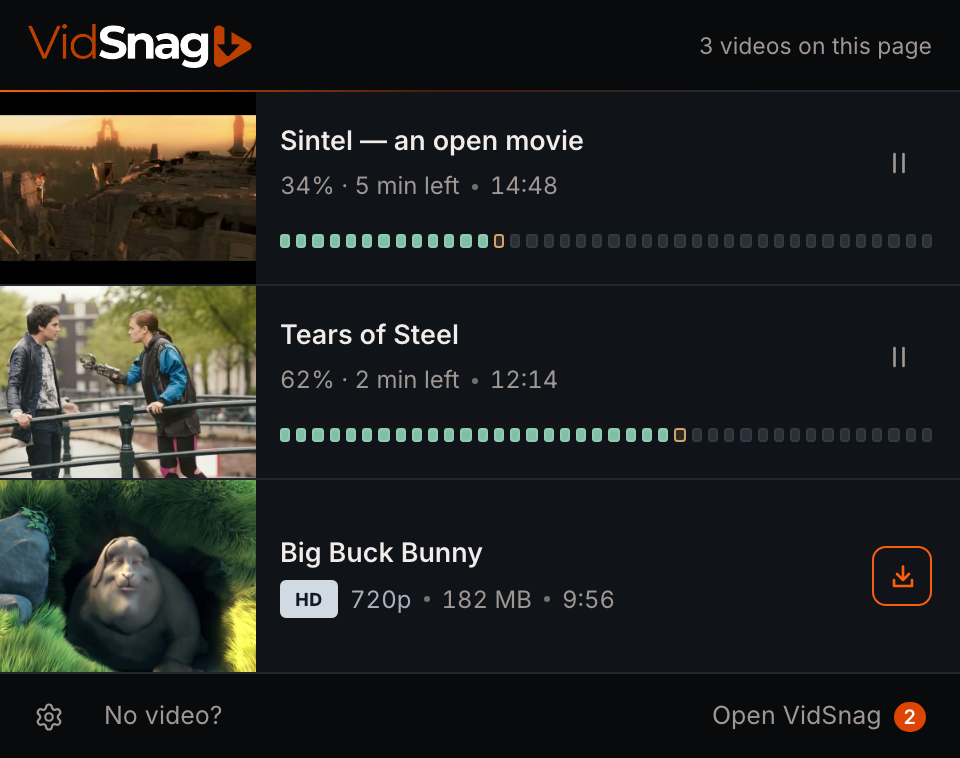
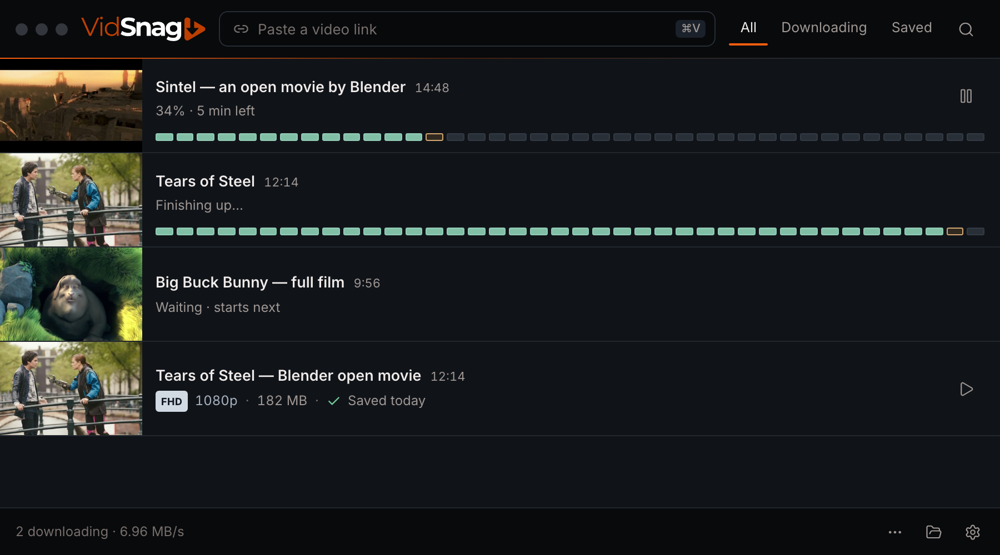

# SnagThis UI design spec — "Workbench, simplified"

Status: **current approved interface**, reconciled with the owner's selections and implemented desktop/extension behavior on 2026-09-20. The current rules below take precedence over older alternatives in the prototype studies.

The baseline is **Workbench, simplified / A · Refined**, with **Soft focus** hover (§3), **Lines**, the **Steel · Very dark** palette, and **Orange line** header/footer treatment. Metadata uses **Solid badge**, **Inset tiles**, and **Quality first**. Thumbnails use **Three dots** and **Flush full height**. Settings use **Grouped cards**, and desktop details use the **inspector card** described in §7.

Interactive references: [UI refresh studies](prototypes/ui-refresh/index.html), [controls](prototypes/ui-refresh/controls.html), [metadata](prototypes/ui-refresh/metadata.html), and [thumbnails](prototypes/ui-refresh/thumbnails.html). They use sample data without starting downloads. The [roadmap](roadmap.md) records the historical migration plan; current release work is in [release readiness](../release-readiness.md). Superseded mock-ups are archived locally under `work/design/`.

| Popup | Desktop |
|---|---|
|  |  |

## 1. Principles

1. **One row, four things.** Every video is a row of: thumbnail, title, one quiet status line, one visible action. Nothing else is visible at rest.
2. **Keep the video clear.** Progress belongs in a compact lane beneath the text and actions, beside the full-height thumbnail. The thumbnail shows a full-colour poster or a silent loop on hover/focus; duration stays outside the image.
3. **Same row everywhere.** The popup and the desktop render the same row component with the same states and copy.
4. **Extras are one step away, never zero.** Quality/subtitles live in a menu; rename, remove, copy link, technical detail live in "⋯" / right-click; settings use named cards; desktop-only technical settings live under Advanced.
5. **Plain words.** No HLS / M3U8 / MP4 / thread / port in the default UI. The owner later chose **Segments** as the visible word for the download map (it replaces "Pieces" in all user-facing copy; older passages and class names that say Pieces refer to the same thing), and it appears only inside details.
6. **Silence when healthy.** Connection state, errors and counts only appear when they need the user. Problems are one amber sentence + one labelled button.
7. **Orange means interaction.** Primary actions, keyboard focus, and the owner's warm row-hover accent use orange. Actual download progress uses the selected Pieces colors.

How we got here: the first concepts (Ember/Focus/Cinema) were rejected as generic; a dense variant (A+) was "too much going on"; a middle variant was tried and the user preferred the simple one. When in doubt, remove.

## 2. Design tokens

Reuse the existing tokens in `apps/desktop/src/globals.css`; the extension's `src/input.css` must define the same names and values (single source of truth: copy the `@theme` block, do not fork values).

| Role | Token | Value today | Used for |
|---|---|---|---|
| Window surface | `--color-background-raised` | `hsl(215 22% 8%)` | popup body, desktop window |
| Row hover / open detail | `--color-background-hover` | `hsl(215 22% 10.5%)` | `.row:hover`, expanded detail |
| Control hover | `--color-background-active` | `hsl(215 22% 13.5%)` | icon button hover, menu item hover |
| Header/footer | `--color-surface-chrome` | `hsl(215 22% 4%)` | matching darker bars on desktop and extension |
| Video row | `--color-surface-row` | `hsl(215 22% 8%)` | row surface on both apps; equal to the window surface so the list is one flat plane |
| Video row hover | `--color-surface-row-hover` | `hsl(215 22% 11.5%)` | hover and keyboard interaction on both apps |
| Inset field | `--color-background` | `hsl(215 22% 3.5%)` | paste field |
| Divider | `--color-border-subtle` | `hsl(215 14% 15.5%)` | visible 1px line between rows, under the last row, and above the footer |
| Control border | `--color-border` | `hsl(215 15% 18%)` | labelled secondary button, settings values; desktop menus use a shadow without a border |
| Text | `--color-foreground` | `hsl(20 20% 93%)` | titles, values |
| Muted text | `--color-foreground-muted` | `hsl(20 6% 60%)` | status line, icon buttons |
| Subtle text | `--color-foreground-subtle` | `hsl(20 5% 52%)` | placeholders, footer summary (≥4.5:1 on raised surfaces) |
| Primary | `--color-primary` | `hsl(18 96% 40%)` | Download button, count badge (white labels 4.6:1) |
| Primary strong | `--color-primary-strong` | `hsl(18 96% 36%)` | hover/pressed fill for white-label buttons |
| Primary hover / focus | `--color-primary-hover` | `hsl(20 96% 52%)` | accents, outlines, indicators, focus ring; never behind white text |
| Attention | `--color-status-paused` | `hsl(44 84% 58%)` | the amber sentence |
| Success | `--color-status-completed` | `hsl(145 62% 46%)` | "Saved" in popup after finishing |
| Destructive | `--color-destructive` | `hsl(0 72% 56%)` | "Cancel download", "Move to Trash" text only |

Typography: Inter. Title 13.5px / 570 weight, with ellipsis or the popup's two-line title treatment. Status line 12px muted. Buttons 12.5px / 600. Duration is secondary text beside the desktop title or in popup metadata; never place it in a thumbnail chip.

Radii: thumbnail 0px (flush with the row), buttons 7px, menus 9px, window 10px. Spacing unit 2px; no left, top, or bottom inset around the thumbnail. Keep a 12px gap to text, 14px at the row's right edge, and vertical padding on text/actions (desktop 10px; popup 12px).

Status colours `--color-status-queued/downloading/failed/cancelled` and all `--color-segment-*` remain defined but are only used inside the details panel.

**Accent (owner revision 2026-09-26, [unique-look option 9](prototypes/unique-look/index.html)):** desktop Settings ▸ Appearance offers Orange (default), Cobalt, Violet, Mint and Magenta. The choice overrides `primary`, `primary-strong`, `primary-hover`, the focus ring, the header line, the logo's "THIS" and the pixel button's bevel shades at runtime on `<html>`, applied before first paint; the `@theme` values above stay orange so desktop/extension token parity holds. White labels stay ≥ 4.5:1 on every accent (Orange 5.04, Cobalt 5.55, Violet 6.28, Mint 4.76, Magenta 5.21 on `primary`). Chrome and buttons crossfade over 240ms; the pixel logo swaps instantly; instant under reduced motion. Progress, success green and amber problem colours never change. **Shared with Chrome (owner revision 2026-09-26):** the choice is a desktop setting (`settings.json` `accent` + `accentChangedAt`), exposed to the paired extension through `GET/POST /v1/settings` and on every `GET /v1/queue` poll (`appearance`), and pushed to the desktop window over IPC. The extension keeps its own copy in `chrome.storage.local` (mirrored to `localStorage` for first paint), offers the same five swatches in its settings sheet whether or not the app is connected, and reconciles on reconnect: the later change wins. The token map lives in `packages/contracts/src/accents.js` for both apps. The Chrome toolbar icon is drawn from the same pixel-button geometry per accent (orange uses the packaged PNGs), and the count badge uses the accent's `primary`.

## 3. The row

```
┌──────────┐  Title, one line, ellipsis                         [⋯ hover] [ action ]
│ thumb    │  Status line, one line, muted
└──────────┘
```

| Part | Popup (480px wide) | Desktop (min 640px, designed at 820px) |
|---|---|---|
| Thumbnail | 128px wide × full row height; flush left, top, and bottom; image crops to fill | same |
| Row height | minimum 96; grows with wrapped content and active progress | minimum 84; grows with wrapped content and active progress |
| Visible action | right-aligned, 30px icon button; Download uses the owner-selected **Outline + breathing glow** (orange outline whose glow swells and fades on a 2.8s cycle — only the first Download button when the popup opens breathes, twice, then rests; others are still — filling solid orange with the owner-selected **Liquid** motion on hover or keyboard focus (an oversized, slowly turning rounded shape rises inside the clipped button, giving a wavy surface and no square edge); still under reduced motion and when disabled), with its tooltip and accessible label | right-aligned, 30px high |
| Duration | metadata line beside quality and size, separated by small round dots and consistent spacing; omit separators for missing values; a separator never starts a line; problem rows show duration beside the title and their sentence may wrap to two lines | beside the title |
| Hover extras | "⋯" appears left of the action on hover or keyboard focus (same menu as right-click; arrow keys move, Escape returns focus) | "⋯" appears left of the action; saved rows also show folder |
| Divider | 1px `border-subtle` on top of every row except the first | same |

Rules:
- Exactly **one** visible action per row. If a state has no sensible action (e.g. "Finishing up…", "Waiting"), show none.
- Rows use `surface-row` against darker `surface-chrome` header/footer bars, with an orange-to-grey divider under the header and a plain divider above the footer. Hover or keyboard interaction uses **Soft focus** (owner revision 2026-09-26; replaces Focus mono): the active row changes to `surface-row-hover` and shows a solid 3px `primary-hover` left edge, while every other row (and any other open details panel) dims to 72% opacity, in colour, over 200ms ease-out. Rows that need attention (problem, missing) never dim, and a row whose ⋯ menu is open counts as active. The edge uses the owner-selected **Grow** motion: it scales out from its middle in 300ms and eases away over 380ms. On desktop there is one edge per item, spanning the row and its open details: an open item shows it in neutral grey (**Grey when open**) and it turns orange while that row is active, so two edges never stack. See the [edge and animation study](prototypes/ui-refresh/edge.html). A desktop row whose ⋯ menu is open counts as active. Both apps use identical values and timing. Nothing is drawn over thumbnails, titles or controls, and they never move. The treatment fades away on leave and does not represent download progress. Desktop keyboard focus keeps its inset orange accent. Reduced motion disables its transitions.
- Whole row is a click target on desktop: click toggles the details panel (§7). In the popup rows are not clickable.
- Right-click anywhere on a row opens the same menu as "⋯".

### 3.1 Row states — copy and action

`QueueJob` fields referenced are from `apps/desktop/src/types/queue.ts`.

| State | Condition | Status line | Thumbnail | Visible action | Hover / ⋯ |
|---|---|---|---|---|---|
| Detected (popup only) | media item not yet sent | `[1080p ⌄]  2.1 GB` (quality is a text-button, §5) | full colour | **Download** (primary) | right-click: Rename, Hide |
| Protected (popup only) | the page's video is DRM-protected (EME in use by its player, DASH `ContentProtection`, or HLS `SAMPLE-AES`/`SAMPLE-AES-CTR` / Widevine, PlayReady or FairPlay `KEYFORMAT`) | muted `Protected by {site} (DRM) — SnagThis can't save it` (`{site}` = `og:site_name`, else the host) | page poster or placeholder, never a captured frame | **Why?** (plain text button; opens the `Protected video` sheet) | right-click: Rename, Hide, Show all detected streams — no Download, desktop handoff, Preview or quality |
| Waiting | `queueStatus = queued` | `Waiting` or `Waiting · starts next` (first in queue) | full-colour poster/preview | none | ⋯: Start now, Move up, Remove |
| Downloading | `queueStatus = downloading`, not finalizing | `{pct}% · {eta}` | full-colour poster/preview | Pause (icon) | ⋯ |
| Finishing | downloading and `status` indicates remux/convert/verify | `Finishing up…` | full-colour poster/preview | none | ⋯ |
| Paused by user | `queueStatus = paused` | `Paused at {pct}%` | full-colour poster/preview | Resume (circle-play icon, tooltip `Resume download`) | ⋯ |
| Needs the user | `failed` with recoverable cause | amber sentence (§3.3) | full-colour poster/preview | labelled button (bordered) | ⋯ |
| Saved | desktop history item / `completed` | `[quality] · {size} · ✓ Saved {when}` (omit unavailable quality) | full colour | Play (icon) | folder, ⋯ (Details, Move to…, Rename…, Copy link, Open page, Show in folder, Remove…) |
| Saved, file missing | file not on disk | amber `File was moved or deleted` | full colour | **Locate** (bordered) | ⋯: Remove from list |
| Popup, desktop download finished | desktop job completed | green `Saved` | full colour | **Play** | — |
| Popup, Chrome download finished | browser job completed | `Saved in Chrome` | full colour | **Show in folder** | Chrome download details |

`cancelled` jobs leave the list at once, collapsing over 180ms (instant under reduced motion) (toast: "Download cancelled · Undo" for 5 s). They never render as rows.

### 3.2 Formatting

Quality uses the selected **Solid badge**: a silver tier label with dark text beside the exact resolution (SD / 480p, HD / 720p, FHD / 1080p, 4K / 2160p). Unknown or unrecognised resolutions never receive an inferred tier. Keep the badge on the main row; quality-dropdown items use resolution text only.

| Value | Rule | Examples |
|---|---|---|
| `{pct}` | `Math.floor(progress)`; never show 100% (switch to Finishing) | `34%` |
| `{eta}` | from `etaSeconds`. `<60` → `under a minute left`; `<3600` → `{m} min left`; else `{h} hr {m} min left`; `null`/unknown → omit the ` · {eta}` part entirely | `5 min left` |
| `{size}` | 1 decimal for GB, integer for MB; unknown → `N/A`; estimates are prefixed `about` only inside menus/details | `182 MB`, `2.1 GB`, `N/A` |
| `{when}` | `today`, `yesterday`, weekday within 7 days, else `12 Sep` | `Saved today · 182 MB` |
| Duration | `m:ss` or `h:mm:ss`; hidden when unknown | `2:20:06` |
| Speed | never in rows. Total speed in desktop footer; per-job speed in details | `7.3 MB/s` |

### 3.3 Problem sentences

One sentence, amber, ends with a full stop only if it contains two clauses. One labelled button.

| Cause (map from `job.error` classification) | Sentence | Button |
|---|---|---|
| Source URL expired / 403 / 410 on manifest | `Link expired. Reopen the page to continue from {pct}%.` | Open page (desktop; afterwards the status reads `Play the video in Chrome, then click SnagThis to continue from {pct}%.`) |
| (popup, same state) | `Link expired at {pct}%. Play the video, then click Download to continue.` | Download (continues the job) |
| Network unreachable / retries exhausted | `Connection lost at {pct}%` | Try again |
| Disk full / not writable | `Not enough space in {folder}` | Choose folder |
| Unsupported / DRM | `This video can't be downloaded` | Details |
| Output file missing | `File was moved or deleted` | Locate |
| Anything else | `Something went wrong at {pct}%` | Try again |

Raw error text is only shown in the details panel.

**Speed trace (owner revision 2026-09-26, [row-activity option 2](prototypes/row-activity/index.html)):** a collapsed downloading row shows a speed trace in the empty space of its text column — a miniature of the Details speed chart with its scale easing to the recent peak and a glowing head dot. Its width is fluid: it starts 16px after the longer of the title and status lines and runs to the row's action column (12px before More), spanning the height of both lines, so short titles get a long trace and long titles a short one; below 48px it hides. It never overlaps text, the thumbnail, the progress lane or controls. It starts at its left edge and grows rightward one fixed 6px step per sample; once the head reaches the right edge it stays pinned there and older samples scroll off the left. It appears from the second sample, because the line's start is the download's real start and needs no zero padding. When the text pushes into it, the trace shrinks at once with a little slack and only reclaims width after the text shrinks by more than 32px, so a ticking status line does not shift it. Paused rows freeze it grey at 60% opacity; finishing rows freeze it amber; a just-saved row turns it mint, then it fades with the lane. Rows without an action keep the button's width so trace ends align. It is hidden while Details is open or the row is being renamed, reuses the Details chart's samples, and carries a non-live label such as "Download speed 3.91 MB/s".

## 4. Video thumbnails and row progress

The owner replaced the original colour-fill thumbnail on 2026-09-19. Earlier screenshots and mock-ups record the previous design; they do not override this revision.

- Show one unobscured full-colour poster, or a silent real video excerpt. No grayscale mask, progress clipping, scan-line or duration badge belongs inside the thumbnail.
- Use the selected **Flush full height** layout: a 128px-wide, square-cornered thumbnail reaches the row's left, top, and bottom edges on both surfaces. Use `object-fit: cover`; the frame follows the whole row height, including the area beside progress, rather than imposing a 16:9 display box. Keep titles, duration, quality, and actions outside it.
- When no usable image is available, use **Three dots**: three small neutral dots pulse in sequence at the centre of a dark placeholder. This indicates thumbnail loading, never download progress. Keep the dots still under reduced motion; remove them when a real poster or preview is shown.
- A roughly ten-second clip loops only while the row is hovered or has keyboard focus. Stop when focus/pointer leaves, the page is hidden or the row is removed. Respect reduced motion by retaining the still poster.
- Put video duration beside the desktop title. In Chrome, move it to the quality-and-size line so long titles have more space; the Download action is an icon button.
- Retain the poster while a clip is unavailable, being generated or fails to play. On desktop, produce clips from already-downloaded footage; do not wait for the entire video. For long segmented videos, allow one interim excerpt around 30 seconds, then replace it once with the real 35%-of-video scene when those segments arrive. Sampling 35% of a short opening excerpt does not qualify as the representative scene. Completed files can repair legacy or interim previews on demand.
- The Chrome popup must provide its own thumbnail and hover/focus excerpt before a desktop job exists, including when the desktop is offline. Use a short, bounded preview from an observed playable source, favour low preview quality, and stop playback/loading when no longer needed. Reuse a ready desktop clip when available. This later owner clarification replaces the earlier assumption that all previews must wait for local desktop media.
- Generated desktop preview artifacts use 16:9 without added black padding; posters and clips both crop to fill the selected full-height display frame. Older padded preview artifacts regenerate on demand. Large direct-file extension previews may use later playable footage within a bounded prefix; they must verify the decoded frame rather than trust a seek timestamp or a truncated file's reported buffer duration. A smaller initial poster probe can fall back to the existing larger bounded read if decoding needs it. Source requests may restore the Origin and Referer captured for that media host, only during the preview.
- For seekable sources, choose a scene around 35% of the full duration; prefer alternatives at 50% and 25% before looking farther afield when frames are black. Do not cap long-video sampling at the opening minute. For short files, prefer a shorter useful excerpt over forcing the scene to time zero just to reserve ten seconds.
- A YouTube popup preview may capture the already-playing page video locally. Keep the supplied YouTube artwork; do not seek, play or pause the user's page to prepare a hover preview. Paused or uncapturable page video keeps its poster. No desktop job or new sign-in is required for this local capture.
- Drive row progress from actual `job.progress`, with the existing status sentence and accessible progress value. Pause motion while paused or waiting. Motion may indicate activity, but must never invent progress.
- Both surfaces use the selected **Pieces** treatment: 40 aggregate progress cells in a 7px-high lane beneath the text and actions only. The full-height thumbnail occupies the left column beside this lane, with no progress drawn beneath or over the image. Completed cells settle in muted green (`#80bfa6`). The owner-selected **Spark** motion: the current cell fills amber (`#f4c38a`) from the left with real progress while pulsing gently (1.9 seconds), and each cell finished while the row is on screen flashes white with a short burst of light (520ms). Opening a list or popup never replays sparks for earlier cells. At most one spark per 250ms; the current cell's fill eases over 400ms linear. Paused and problem lanes show finished cells in desaturated `#5f7f73` so they read differently from active ones. The lane represents overall progress, not the actual number of media chunks. Paused/problem and reduced-motion states are still; detected, waiting and saved rows have no lane. Desktop uses an 8px gap above the lane to remain compact. The earlier extension studies are archived locally; the thumbnail study supersedes their full-width lane geometry.
- The earlier A+B motion comparison is archived locally. Its warm background fill, glowing edge and sweep are superseded on both surfaces; they are not current production requirements. The detailed desktop Pieces map continues to show actual segment telemetry separately.
- Do not put “Preview,” clip-length labels or other hover text over the video. Accessible labels may describe the preview without occupying video space.
- Saved desktop rows retain a small checkmark badge by their status, while their background remains quiet.
- Prefer a representative, nonblack frame from downloaded media over a page screenshot or generic site poster. Preserve YouTube's supplied artwork. Repair old saved-video posters when preparing their local previews. Poster updates must not reset download progress.
- Reject black candidate frames and sample another part of the available video. During downloading, retry as new local footage becomes available. If no usable frame exists yet, keep the existing poster or neutral placeholder instead of publishing a black replacement.

- The speed trace advances one 6px step per 650ms sample: its head glides smoothly while the trace grows, and only once it is full does the line scroll smoothly beneath the pinned head. Its scale eases 6% per frame. Width changes from window resizes or text changes are observed with one shared ResizeObserver and redrawn once on the next animation frame, with no text measurement reads. Under reduced motion it updates only when a sample arrives, with no gliding, scrolling or glow. It does no work off screen, in a hidden window, or while its row is expanded.

## 5. Popup (`apps/extension`)

Width 480px, per owner revision: quality, size, and feature-length duration fit on one metadata line. Max height 560px; the list scrolls, header and footer are fixed. Chrome controls the native popup window's outer corners.

```
┌ header ─ logo · "{n} videos on this page"                         ┐
│ [banner — desktop connection or compatibility guidance, if needed] │
│ rows…                                                             │
└ footer ─ ⚙ · "No video?"                     "Open SnagThis" (n)  ┘
```

| Element | Spec |
|---|---|
| Brand and surfaces | Use the full SnagThis logo artwork instead of a mark with separately typeset text: the owner-approved pixel lockup (round 9: W5 · I3 · B4 · zover · A10, [prototype](prototypes/logo-rebrand/round9-pixel-wordmark-idle.html#W=w5&I=i3&B=b4&L=zover&launch=a10)) — `SNAGTHIS` in capitals from the Jersey 15 pixel face (SNAG white, THIS orange `#fa5d0e`), followed by the **Pixel bevel** play button. The button is the 16 × 16 stepped-corner orange tile lit from the top left (amber `#ffb238` edge, deep-orange `#bd3f00` edge) with a night `#0c0e11` stepped triangle and a one-pixel deep-orange shadow. One letter pixel equals one button pixel: 15-pixel capitals, a 16-pixel button one pixel taller than the capitals and centred on them, an 8-pixel gap. The artwork is pixel paths generated by `scripts/render-brand-assets.cjs` (no font ships), shown 120×22px with one logo pixel per CSS pixel. The popup count sits independently at right. Header and footer use `surface-chrome`, an orange-to-grey line under the header, and a plain footer divider. Desktop matches the same treatment. |
| Header text | `No videos yet` / `1 video on this page` / `{n} videos on this page`. No connection indicator when healthy. |
| Row order | Longest known duration first, shorter videos below; unknown durations last. Equal durations keep their discovery order. |
| Footer left | Settings (gear icon, opens the settings sheet §8), `No video?` (opens help: the empty-state text plus `Some sites protect their videos. See troubleshooting.`, linked). |
| Settings sheet | Owner-selected **Icon tab bar** ([popup-settings option 3](prototypes/popup-settings/index.html), 2026-09-26). Under the `Settings` header, which always shows a **SnagThis settings ↗** button (opens desktop Settings through `snagthis://open/settings` or the connected app), a 40px strip of icon + label tabs sits flush: **Downloads · Appearance · Connection · About**, with the desktop's Lucide section icons and a pixel-stepped accent underline on the chosen tab. `role="tablist"`/`tab`/`tabpanel`, roving `tabindex`, automatic activation with ←/→ (wrapping), Home/End, and Tab into the focusable panel. Settings opens on Downloads and reopens on the last tab used while the popup is open. The Connection tab carries a 6px status square (green connected, amber SnagThis not open, grey not connected) and its accessible name says the state (`Connection, SnagThis not open`). While Settings is open the popup keeps the height of its tallest tab (at least 430px, at most 560px), so switching tabs never resizes Chrome's window, and no tab scrolls at 480 × 560. Contents are in §8. |
| Footer right | `Open SnagThis` focuses the connected desktop app; when unpaired it starts pairing in the banner (§8), and when the app is unreachable it becomes `Don't have the app? Get it`. The orange count badge counts desktop downloading/waiting jobs only and is hidden at 0. |
| Removed from today's popup | "Bridge" pill, "Detected Media" heading, refresh icon (auto-refresh on open), "Clear Media" button (replaced by per-row Hide in right-click; list resets on navigation), API host:port text, type/resolution pills, hostname + content-type row, Stream button (moved to right-click → "Preview"). |

### 5.1 Download flow

1. Click **Download**. Supported standalone MP4/WebM files use Chrome's native downloader without desktop pairing. Streams, separate tracks, processing, and an explicit **Download with desktop** choice use the desktop app.
2. Show a starting state while submission is pending, then reflect the accepted download's real progress. Keep the thumbnail clear. If a source needs desktop and it is unavailable or unpaired, show **Use desktop app** guidance rather than starting a browser download.
3. The extension worker owns browser-download state and desktop job mappings, so closing and reopening the popup preserves the appropriate row. Refresh browser state from the worker and desktop state from `GET /v1/queue` while open; do not make browser state depend on desktop health.
4. Chrome completion shows **Saved in Chrome** with **Show in folder**. Chrome controls its save location, safety prompts, and resume support; these files are separate from the desktop library. Desktop completion shows **Saved** with **Play** through the app.
5. Show progress, pause/resume, retry, and errors according to the selected backend. When Chrome has no total size, show its downloading state without inventing a percentage.

Closing the popup never cancels either kind of download. Desktop downloads still require the desktop app to keep running.

### 5.2 Quality menu

- Trigger: a compact borderless dark button in the status line (`1080p ⌄`), with brighter text, an orange chevron, and distinct hover/open feedback. Rotate the chevron and expose `aria-expanded` while open. Keep its width stable so size and duration do not shift. Shown only when more than one real variant was discovered; otherwise plain text (`720p`) or nothing.
- Default selection: user's Preferred quality setting (default "Best"), falling back to the highest available.
- Items: one per discovered variant, highest first: label `{height}p`, right-aligned size. Dropdown items use resolution text only (such as `1080p` or `720p`), without tier badges; keep the main-row quality badge. Label bitrate × duration ÷ 8 estimates with `about`; show `N/A` in the row and menu when neither a total nor an estimate is available. Playlist response bytes are never the video size. `Audio only` last, only if an audio rendition exists.
- Group `Audio <N tracks>`, only if more than one separately downloadable audio rendition exists (owner-selected **Labels 2 · Plain language** and **Sample 3 · Hover to hear**, [audio-tracks](prototypes/audio-tracks/index.html)). A `Quality` title then heads the variants and the menu widens to 286px. Each track is a `menuitemradio`: bold title with tags, then one muted line. The DEFAULT rendition is selected by default; the trigger reads `1080p · {language or Track N}` while audio tracks exist.
  - **Labels** (shared by both surfaces, `packages/contracts/src/audioTracks.js`): the language's English name from `LANGUAGE` / DASH `lang` via `Intl.DisplayNames` (`hin` → Hindi, `es-419` → Spanish (Latin America)); `und`, `mul`, `zxx`, `mis`, `qaa–qtz` and codes returned unchanged are unknown. Keep `NAME` / DASH `label` only when it adds meaning (not `Track 2`, `Audio`, a copy of the code or of the language name). Tags: `5.1`, `7.1`, `Atmos` (JOC) chips only when channel layouts differ between tracks (`Stereo` then goes in the muted line); `AD` chip from `public.accessibility.describes-video` or DASH Role/Accessibility `description`; `Commentary` from DASH Role or the name; `Default` from `DEFAULT=YES` / Role `main`. Nothing known: title `Track N`, line `Unknown language` (`· Default`), and a note under the group: “This site doesn’t name its tracks. Rest on one to check.” Identical renditions repeated across `GROUP-ID`s collapse into one track; titles that still match get `· 2`.
  - **Choosing** sends the rendition identity (`selection.audioTrack`: language, name, channels and characteristics, not the URL or group) only when it differs from the DEFAULT; the engine resolves it within the chosen variant's audio group, so nameless tracks without `LANGUAGE` download correctly. DASH (yt-dlp) choices are offered only when every track has a distinct language and send `audioLang`. The popup asks the desktop's `/v1/health` `features` for `audio-track` before sending a choice.
  - **Hover to hear:** after the pointer or keyboard focus rests on a track for 500ms, fade in a 10-second sample from 25% into that rendition at moderate volume; a speaker glyph animates, the row tints and a 2px line shows progress. Only one sample plays. It stops on pointer leave or blur, choosing, the first Esc (the second closes the menu), closing the menu or popup, and when the popup is hidden. Space plays or stops the focused track; Enter chooses. Loading shows a stepped speaker; failure shows amber `Sample unavailable · you can still choose it` and the track stays choosable. Announce loading, playing, stopped and failed politely. Reduced motion removes the speaker animation and dwell line and moves progress in whole seconds; sound is unchanged. Popup samples load the audio playlist into an `<audio>` element with the vendored hls.js through the bounded source-preview loader and restored Origin/Referer session. Muxed-only sources show labels only.
- Second group `Subtitles`, only if subtitle renditions exist: languages, then `None`.
- Menu is a fixed overlay anchored under the status line when space allows, 250px wide, fitted inside the existing popup bounds. A short popup grows to at least 300px (max 560px) while a menu is open; the menu opens below its trigger, flips above only when it cannot fit, never covers the header and is never clipped. Rows, thumbnail, title and header do not move. Initial and restored focus must not scroll the page. Keyboard: ↑/↓, Enter, Esc; `role="menu"` with `menuitemradio`.
- Duplicate detections (master playlist + its variant playlists, same video as HLS and MP4) must collapse into **one row**; the alternatives become menu items. Collapse only when the variant URL is listed in the master playlist, or duration and page match exactly; never on filename similarity alone. Escape hatch: right-click a row → `Show all detected streams` expands the collapsed items as separate rows for that page visit.
- **Stream pieces are never rows.** fMP4/CMAF fragments, init segments, byte-range requests and audio-only pieces fold into their manifest when it is known (listed URLs, segment directories or a DASH `SegmentTemplate` pattern). Without a manifest, a file the page's own script fetched is hidden when its name marks a piece (`init`, `seg-12`, `chunk_3`, `/range/…`), when it belongs to a burst of numbered siblings, when it was a byte-range (206) request, or when it has no duration and is under 1 MB (or is far too small for the duration it borrowed). Files a `<video>` element plays directly are always standalone, however short. `Show all detected streams` still lists every piece.
- **DRM.** SnagThis never captures, records, decrypts or saves DRM-protected media, and never uses screen or tab capture instead. When the page's player uses Encrypted Media Extensions, or a manifest declares protection, its manifests and pieces become **one** Protected row (§3.1) for that title. Other media on the page that is proven clear (a parsed playlist without DRM keys, a file played directly by its own `<video>`) keeps its own ordinary row. Plain HLS AES-128 is not DRM and stays downloadable. **Why?** opens a sheet: `{site} locks this video with DRM (digital rights management), so it only plays inside its own player. SnagThis respects that: it never records, unlocks or saves protected video.` / `Other videos on this page that are not protected are still listed and can be saved.` plus a Troubleshooting link. The service worker refuses a download of protected media even if asked directly.
- Duration, resolution, and artwork belong to the matching media source. Switching a page player from a trailer to a movie must keep their detections separate and preserve each source's metadata; parsed media-playlist duration is authoritative. Keep each known source duration visible beside size in the popup metadata, including when size is `N/A`, so trailers and full videos remain distinguishable.

### 5.3 Popup thumbnails

Order: supplied YouTube artwork → usable current or verified preview frame → `<video poster>` → placeholder. Generic non-YouTube `og:image` / `twitter:image` artwork is not used as a video-poster fallback. The content script rejects black/blank frames and silently falls back when the canvas is tainted; it must not seek or alter page playback. Captured frames are ≤ 20 KB JPEG data URLs (208×116). A verified frame from the popup's own short source preview is retained with its detection in `chrome.storage.session`, so reopening the popup can reuse it without requiring a desktop job. Preserve supplied YouTube artwork.

If a visible popup row has no usable poster, start one bounded frame extraction on popup open without waiting for hover. Use the existing middle-of-video sampling and black-frame fallback, stop after obtaining a usable frame, and retain it with that detection. Work one row at a time; stop when the popup closes or becomes hidden, and give hover playback priority. Do not automatically loop or alter playback on the source page.

Prepare a representative poster before popup opening when the source page has already decoded a usable frame between 35% and 80% of its duration. Capture once for that source and page visit, through the existing detection/session metadata; this must not seek, start playback, or fetch media. Opening frames are not treated as representative scene posters. Keep offsets from a partial direct-file prefix distinct from offsets in the full source, so a temporary opening excerpt cannot override later middle-of-video selection.

### 5.4 Popup states

On opening, the content is fully visible on its first frame, with no fade or settle; Chrome owns the outer popup window. Show cached detections immediately; nothing on first render waits for the page, the desktop app or a connection-key upgrade. The page scan answers from the page's own main thread, which a busy site can hold for seconds, so each frame gets at most 300 ms: until then, show three skeleton rows (128px block + two bars, 1.6s linear shimmer, static under reduced motion) with a screen-reader-only "Looking for videos…" and "Checking this page…" count instead of briefly showing an empty list. After that the popup shows what it has (rows, or the empty state), and a slower frame's detections arrive as new rows when they are stored. Discovery runs independently of desktop health checks. Reveal newly arriving rows once, without replaying entrance motion on progress updates. Empty and failed scans end the busy state and offer a retry. Reduced motion removes the entrance animations.

While open, the popup refreshes every second only while a download is active or starting, and every 4 s otherwise (new detections on the page refresh it at once), and rechecks the desktop app every 2 s. A refresh only touches rows, cells and banners whose content changed. hls.js loads on first use by a preview, poster probe or audio sample, not with the popup.

| State | Spec |
|---|---|
| Nothing found | Pixel mascot (48px, waiting), `Press play on the video`, `SnagThis spots a video once it starts playing. Start it, then open this again.`, bordered **Check again**. |
| Desktop app unreachable | Banner: `Save supported files in Chrome. Open SnagThis for streams and more.` with **Open SnagThis**, using the implemented `snagthis://open` handler; if unreachable after 3s, offer **Get the app**. Continue checking health every 2s. Direct Chrome downloads remain available. Only actions needing an existing desktop job are disabled; detected streams can open **Use desktop app** guidance. |
| Desktop app reachable, not paired | When SnagThis is `Waiting for Chrome…` (§8), no button: the request starts by itself and the banner shows the digits. Otherwise one banner, `Connect SnagThis desktop for streams and more.` with **Connect** (one tap starts pairing, §8) and a ⋯ menu with **Use a code instead**. Native Chrome downloads remain available. |
| Disconnected | After **Disconnect** on either side, or when the desktop rejects the stored key: `Disconnected from SnagThis. Supported files still save in Chrome.` with **Connect again**. Chrome doesn't ask on its own after a Disconnect; **Connect again** runs the one-tap flow. |
| Extension/app version mismatch | Identify the component needing an update: `Update the Chrome extension to use desktop downloads.` with **Update Chrome extension**, or `Update SnagThis to use desktop downloads.` with **Update**. Keep native Chrome downloads available. |

### 5.5 Preview player

Right-click → **Preview** opens `player.html` in a tab. The owner chose **A · Cinema** from the [preview-player studies](prototypes/preview-player/index.html) (2026-09-29): the video owns the whole tab, with one top bar and one floating control bar over a full-bleed `<video>` (no native `controls`). Strings are the `player*` keys in `packages/contracts/src/strings.js`; styles are the `pl-` rules in `apps/extension/src/input.css`, using the shared tokens and accent bevel.

| Element | Spec |
|---|---|
| Session | The popup passes the row's source, page, title, type, observed headers, tab id, row id and local API base to `CREATE_STREAM_SESSION`; the worker binds the session to that row only when the row still lists that exact source, and pins it to the tab's page visit. Sessions last 10 minutes. The page reads nothing else from its URL. Signed media URLs, header names and diagnostics never appear on the page. |
| Top bar | Pixel button mark (30px); title (18px, one line, ellipsis); a sub-line: site chip (page host, pixel face) · `Preview` · `HLS stream` / `MP4 file` / `WebM file` / `Video file`. On the right: a glass **Details** button (`I`) and the orange bevel **Snag it** with `{quality} · {size}` after a divider (size only when known; estimates read `about …`, §5.2), and one muted line under it: `Downloads with SnagThis`, `Saves in Chrome` for a supported direct file, or `Needs SnagThis for desktop` when the desktop app is not ready. Below 820px the quality · size and the line under it collapse. |
| Control bar | Centred, max 1080px, 20px above the bottom, translucent with stepped 4px pixel corners. Scrub bar on top: buffered range, hover range with a time tooltip (no thumbnail: that would need a second decoder), accent fill and a bevel knob that appears on hover, drag or focus; it is a `slider` with `aria-valuetext` "0:03 of 0:10" (←/→/↑/↓ 5s, PageUp/PageDown 10s, Home/End). Row: play/pause, back 10s, forward 10s, mute with a volume slider that opens on hover or focus, current / total time (pixel face), then speed (`1×` pill), quality (`Auto` pill; only with two or more levels), audio and subtitles (CC; only when the stream has more than one audio track or any subtitles), keyboard shortcuts, picture-in-picture (only where supported) and full screen. |
| Auto-hide | While playing, the top bar, control bar and shade fade (220ms) after 2.4s without pointer movement, and the cursor hides; captions drop lower. They return on pointer movement, key presses or keyboard focus, and never hide while paused, while a menu, Details, shortcuts or guidance is open, or while a control has keyboard focus. |
| Menus | Pop above the bar, right-aligned, `role="menu"` with `menuitemradio` items and a square accent marker: **Speed** (0.5×–2×, `Normal`), **Quality** (`Auto` with `now {height}p`, then each `hls.levels` entry highest first with the row's size for that rendition; footer `Snag it saves the quality you pick.`), **Audio and subtitles** (two columns when both exist; subtitles `Off` first; footer `Press C to turn subtitles on or off.`). Focus moves to the checked item; ↑/↓, Home/End, Enter/Space choose, Esc and Tab close, and focus returns to the trigger. Subtitles use hls.js text tracks in `hidden` mode; the page draws the cues above the bar. |
| Details | A 340px drawer from the right (full width below 820px): Site, Page (host and path, never the query), Length, Quality, Size, Type, Audio, Subtitles (only rows with a value; figures in the pixel face), a second **Snag it**, its line, and **Open page**. Focus moves into it and returns to the Details button; Esc closes. |
| Snag it | Sends `SNAG_STREAM_SESSION` with the picked level's variant URL (or none for Auto). The worker rebuilds the popup row's own choice (`selectMedia` with the saved quality preference, then `buildDownloadPayload`) and calls the popup's `DOWNLOAD_MEDIA` path: Chrome for a supported standalone MP4/WebM file, SnagThis for streams, with the existing pairing token, DRM refusal and store-build rules. A variant URL that is not one of the row's qualities is ignored. Success shows a toast `Sent to SnagThis · 480p · about 1 MB` (or `Saving in Chrome · …`), a ✓ on the button and the snag burst (none under reduced motion). **Snag it** is not shown for protected rows, rows no longer on the page, or, in the store build, YouTube media and anything on a YouTube page. |
| Desktop guidance | Inline under **Snag it**, the popup's own words (§5.4): not connected → `Connect SnagThis desktop for streams and more.` with **Connect** (the one-tap request of §8, showing the four digits and `Choose Allow there if the digits match`, then `Connected to SnagThis`); unreachable → the **Use desktop app** sentence with **Open SnagThis** (then **Get the app** after 3s); version mismatch → the matching update sentence and button. Nothing is sent until the desktop is ready. |
| Loading, buffering | Loading: three stepped dots and `Loading preview` over the dimmed stage; the bar is dimmed and inert. Buffering: a 3 × 3 stepped spinner. hls.js (`vendor/hls.min.js`) is fetched only for HLS sources and keeps the Fetch-only loader, `redirect: 'error'` and exact-origin credential rules; WebVTT fragments load whole. |
| Start, pause | The 104px pixel play button sits centred whenever the video is not playing (including when autoplay is refused); click or double-click the video to play/pause or enter full screen. |
| Failure | One card over the dimmed stage (the top bar stays): pause-glyph mark, a pixel heading and one sentence. 403 → `This video plays only on its page` / `{site} wouldn't let the preview load it here.`; other fatal errors → `Preview unavailable` / `The preview couldn't load this video here.`; either adds `You can still watch it on the page, try again, or snag it.` (without `or snag it` when Snag it is not offered), with **Open page** (bevel), **Try again**, **Snag it anyway** and a `Why can't it play here?` disclosure. DASH stays refused before loading: `This video plays only on its page` / `This video can only be previewed on its page. Open the page to play it.` with **Open page** only. |
| Expired | `This preview expired` / `Previews open for 10 minutes after you choose them. Choose Preview in SnagThis again to reload it.` with **Open page** when known. |
| Keyboard | Space/K play–pause; J/L ±10s; ←/→ ±5s; ↑/↓ volume; M mute; F full screen; C subtitles on/off; I Details; P picture-in-picture; 0–9 jump to 0–90%; `<`/`>` speed; `?` shortcuts dialog; Esc closes the open menu, guidance, Details or dialog. Menus keep their own keys, arrows move a focused volume slider, and Space on a focused button presses it. A short on-screen flash confirms each key and is announced in a polite status region. |
| Reduced motion | No fades, slides, pulses, spinner steps or snag burst; controls still auto-hide and the key flash appears without motion. |

## 6. Desktop (`apps/desktop`)

One window, one list. Minimum 640 × 480; designed at 820 wide.

Use the same full SnagThis logo artwork in the desktop header at 120×22px; do not recreate its lettering with UI text. Owner-selected idle motion **I3 Shine on hover only**: the logo is still until it is invited: when the pointer enters it, at most once a second, in the popup and on desktop (owner revision 2026-09-28; the 2026-09-26 window-focus shine is retired). On desktop the logo and the All / Downloading / Saved tabs still move the window: pressing and moving a few pixels drags it from JavaScript (`useWindowDrag`, `window:drag-start`/`drag-end`), because a native drag region would receive no pointer events. A drag never counts as a click. One cream shine sweeps left to right in pixel steps (0.9s), clipped to the artwork's alpha, never on a loop. Reduced motion disables the shine.

Owner-selected desktop startup: **A10 Type, then press**, **Center → header**. On the first launch only, the lockup appears centred at three times its header size on the chrome surface: after a 150ms pause an orange block cursor types `SNAGTHIS` one capital every 50ms, moves to where the button belongs, and disappears as the button pops in there (scale .25 → 1.14 → 1 over 260ms). 80ms later the button presses like hitting play (520ms: it sinks and shrinks slightly over a hard shadow while its lit and shaded bevel edges swap, then springs back). After a short hold (1.75s from launch) the whole logo moves onto its actual header artwork over 620ms, `cubic-bezier(.65,0,.2,1)`, while the backdrop fades and the app appears (about 2.4s total). Initialization continues underneath. Play once (`snagthis.startupSeen`), respect reduced motion (no overlay at all), never block the app, and let any key or click dismiss the entrance. Later launches fade and scale the finished logo into the header over 600ms, `cubic-bezier(.2,.8,.2,1)` (owner revision 2026-09-26). Reopening menus, changing tabs, and queue updates do not replay it. The extension keeps its existing popup entrance and the hover shine.

```
┌ top bar ─ ●●● logo [ Paste a video link            ] All · Downloading · Saved   🔍 ┐
│ rows (unified: active + waiting + problems + saved)                                  │
└ footer ─ "2 downloading · 7.3 MB/s"                                        📁   ⚙   ┘
```

| Element | Spec |
|---|---|
| Navigation | The Navbar with Queue / History / Settings is **removed**. Queue and History merge into one list; Settings becomes a sheet (§8). |
| Identity | Show the logo and `SnagThis` together. |
| Window title bar | Owner-selected **Unified header** ([title-bar](prototypes/title-bar/index.html) option 2): the dark top bar is the window's title bar; there is no separate system strip. **macOS:** `titleBarStyle: 'hiddenInset'` with the real traffic lights at `trafficLightPosition { x: 20, y: 20 }`, centred in the 53px bar; the header's left padding becomes 94px so the logo clears them with a 14px gap. In full screen (`enter-full-screen` / `leave-full-screen` → `window-fullscreen` class) the lights hide and the logo returns to 14px over 260ms (instant under reduced motion). **Windows/Linux:** `titleBarStyle: 'hidden'` with `titleBarOverlay { color: surface-chrome #080a0c, symbolColor: foreground-muted #9f9793, height: 52 }`, so the 1px accent line stays visible; the header reserves the caption buttons on the right with `env(titlebar-area-*)` (fallback 138px). Overlay colours are neutral and never follow the accent. **Drag:** the header background is `drag` (double-click zooms/maximises per the OS setting); the logo, paste field, tabs, search and every button are `no-drag`. Native behaviour is kept: traffic-light hover/Option-click/tiling menu, full screen, Windows Snap layouts, Alt+Space, and screen-reader access to the real window buttons. **Menus:** macOS keeps a standard application menu (app menu with Settings… ⌘,, File, Edit with undo/cut/copy/paste/select all, View with full screen plus reload and developer tools in development, Window). Windows and Linux have no menu bar; text-field shortcuts work natively. The window background is surface-chrome, so a slow or failed load never shows white. The logo and all empty header space drag the window; the paste field is capped at 460px so there is always empty space to grab, and the tabs and search sit at the right. |
| Paste field | Always visible. Placeholder `Paste a video link`. ⌘V anywhere in the window with a URL on the clipboard focuses and fills it. Enter inspects the link. While resolving: inline spinner + `Checking link…`. A single link with quality/audio/subtitle choices shows the resolved video title and real available choices before Download creates a job; audio tracks use the §5.2 labels and hover-to-hear as a radio list (the picker widens to 312px), with samples cut by the local bridge (`POST /api/media/audio-sample`: bundled FFmpeg, the inspection's scoped request context, 10 s from 25% in, cached per track and deleted on exit); Esc first stops a sample, then closes. Preserve the resolved title and source-page identity in the submitted job. After creation the field clears and the row appears at the top of its group; on inspection failure show the amber sentence beneath the field for 5s and create no job. Multiple URLs (newline-separated) create multiple rows. |
| Tabs | `All`, `Downloading` (downloading + waiting + paused + needs-the-user), `Saved`. No counts. Owner-selected **Follow hover**: a soft neutral highlight glides between tabs under the pointer, and a 2px orange line slides to the selected tab (no filled pill). The selection line moves over 240ms without overshoot. Tabs and search are hidden until the library has a video. Reduced motion moves both instantly. |
| Search | Icon button → expands over the tabs into a text field; filters titles across the **whole** library (server-side, fixes the 200-item cap). Esc closes. |
| Ordering in `All` | 1) needs-the-user, 2) downloading, 3) paused, 4) waiting (queue order), 5) saved, in the chosen Sort & group view (newest first by default; §6.2). No section headers unless grouped. Waiting rows are drag-reorderable (existing `/api/queue/:id/move`). |
| Footer left | Healthy: `{n} downloading · {total speed}`; idle: `Saving to {folder}`. Browser connection is not shown when healthy. If the extension has never connected: `Add SnagThis to Chrome` link. |
| Footer right | Open save folder, Settings. |
| Removed | QueueSummaryBar, QueueSettingsBar (→ Settings ▸ Advanced), QueueToolbar bulk buttons (→ footer ⋯ menu: Pause all, Resume all), per-row speed, inline SegmentHeatmap, HistoryToolbar incl. **Clear History** (replaced by per-row Remove; see §9). The owner's later revision adds a compact Saved check badge beside the status. The footer ⋯ shows at rest when two or more downloads are active. |

### 6.1 First launch

Paste field gets a primary-colour border. Centre: icon tile, `Download your first video`, `Paste a link above, or play a video in Chrome and click the SnagThis icon in the toolbar.`, then, until a browser has connected, the compact **Connect Chrome** card (§8, pair from the desktop): `Click [SnagThis] in Chrome’s toolbar` as a small chip, a blinking pixel with `Waiting for Chrome…`, and the muted link `Don’t have it yet? Add SnagThis to Chrome ↗`. The card listens for Chrome only while it is on screen, uncovered and the window is visible; when Chrome asks, it turns into the approve card in place, and after Allow it folds away. The block sits at about 30% of the height. An empty `Downloading` or `Saved` tab shows one muted line only (`Nothing downloading` / `No saved videos yet`).

**Unique-look additions (owner revision 2026-09-26, [unique-look](prototypes/unique-look/index.html) options 1, 2, 3, 6, 7):**
- **Pixel mascot:** empty lists show the pixel play button (64px; 48px on the Saved shelf) in place of the icon tile — waiting on first launch, dozing on `Nothing downloading`, on a shelf for `No saved videos yet`. It moves in hard steps and presses on hover; static under reduced motion.
- **Snag moment:** a download that finishes while the window is visible bursts 14 pixels from its action (600ms, 8 steps); a 16px button then arcs to the Saved tab (560ms), the tab bumps (240ms, 3 steps) and `+N` rises and fades (700ms). Completions within 2s share one arc. It never plays on load, refresh or search. Hidden windows and reduced motion get a 5px Saved dot until Saved is visited.
- **Pixel-grid chrome:** the header and footer carry a 4px dot grid (6% white), 1-in-3 scanlines and an accent glow behind the logo, as background layers only; text contrast is unchanged.
- **In the popup (owner revision 2026-09-26):** the mascot appears at 48px in the empty and failed-scan states and at 32px in the first loading skeleton; the header and footer carry the same pixel-grid chrome; downloading desktop rows show the speed trace after the title (Chrome-only downloads report no speed and show none); a download finished while the popup is open bursts pixels from its action and raises `+N` from **Open SnagThis** (desktop saves only), with a 5px dot there under reduced motion or when hidden. Drop to snag, the shelf and ⌘K stay desktop-only.
- **Drop to snag:** dragging a link (not a file or an internal row drag) onto the window shows the drop overlay where the pixel button catches it; a drop is submitted exactly like a paste and the result is announced. Ignored while Settings or a dialog is open.
- **Saved shelf:** a list ⇄ shelf toggle beside search on Saved, remembered. Shelf tiles use Soft focus and a 3px accent line under the 16:9 poster; Play and ⋯ sit beside the title, never over the poster. Arrow keys, Home/End move through the grid; Enter/Space plays (Locate when missing); Delete removes; Details returns to the list and opens that row. Views crossfade over 160ms (instant under reduced motion).

### 6.2 Folders, moving, sorting and grouping

The owner chose **B · Real folders** with **C's Sort & group** from the [organise studies](prototypes/organize/index.html) (2026-09-28). Preview every state with `?gallery&organize=<state>` (`folders`, `folder`, `drag`, `moveto`, `select`, `delete`, `sortmenu`, `grouped`, `failed`, `new`, `shelf`, and for the path bar `three` and `long`). Folder rows follow owner choice **C · Sections** from the [folder-row studies](prototypes/organize/folder-rows/index.html) (2026-09-29); the path bar follows owner choice **D · Minimal** from the [path-bar studies](prototypes/organize/path-bar/index.html) (2026-09-29).

**On disk.** Folders are real subfolders of the save folder (Settings ▸ Save videos to; the app's download folder when none is chosen), nested as deep as people like. A saved video lives in exactly one folder. A video's *own* folder is part of the video, not a folder of Saved: new downloads get one marked with `.snagthis-job.json`; older ones are named by job ID, or by title with just that video inside. Moving a video moves its own folder whole; a loose video moves with the files that share its name (subtitles, poster) and its job's `{id}-…` side files, all renamed together with ` (2)` if a name is taken, never overwriting. Same-volume moves are a rename; across volumes (an external drive, a NAS) the file is copied in the background, flushed and size-checked before the original goes, so the app, its progress and window dragging keep working during a long copy, and a video is never left split between folders. A finished download moving to a save folder on another volume stays in progress until its copy is done. The library index and any finished job follow the new paths. Folders and videos added, renamed or moved in Finder or Explorer appear on the next rescan (window focus, opening Saved or a folder, the regular refresh; these are coalesced, so only one rescan runs at a time and one more follows a change made meanwhile); there is no file watcher. A video moved out of the save folder shows `File was moved or deleted` with **Locate** (§3.1).

**Which folders Saved shows.** The save folder may be a general folder such as all of Downloads, so Saved does not list every folder in it. A folder shows when a video is somewhere inside it (at any depth the rescan reaches), or when it was made, renamed or had videos moved into it in SnagThis; those stay, empty or not, until deleted. SnagThis records them in its library index (`keptFolders`, absolute paths) rather than writing marker files into people's folders, so a folder made in SnagThis and then renamed in Finder while empty drops out of Saved. An empty folder made in Finder or Explorer shows once a video is in it. Rescans are bounded so a large folder never stalls the app: folders are read asynchronously a few at a time, shallow ones first, at most 8 levels deep, at most 50,000 entries (files and folders) and 2 seconds per rescan; hidden folders, package and cache folders (`node_modules`, `__pycache__`, `site-packages`, `bower_components`) and bundles (`.app`, `.framework`, `.photoslibrary`, `.fcpbundle` and the like) are not entered. Videos found by an earlier rescan beyond those limits stay listed (and are checked directly), in the nearest folder Saved shows. Unforced rescans wait at least a second, and twice the last rescan's length, after the previous one. A `.ts` file in the save folder is a video only when it is a transport stream (its first packets start with the 0x47 sync byte), when it sits in SnagThis's own video folder, or beside its `.mp4`; TypeScript source is ignored.

**Saved** is the folder being shown. A 42px path bar sits under the header (**D · Minimal**): the save folder's name after a 16px pixel folder in the accent's bevel colours, then each folder as plain 13px text with a pixel `/` between, the current folder last in the accent (semibold), the others muted. There is no back button and no path text: a parent segment, or ⌘↑ (Alt+↑ on Windows and Linux), goes up, and the folder just left keeps focus. Hovering a parent brightens it with a dotted 2px pixel underline; keyboard focus draws a 2px accent ring. Every earlier segment opens its folder and takes dropped videos (rows or shelf posters): it fills with the muted accent, gains a 1px accent outline and a solid underline, and the root's pixel folder opens. Segments cap at 220px (the current folder at 380px) with an ellipsis and the segment's path in its tooltip; when the trail still doesn't fit, the middle folders fold into one **…**, nearest the save folder first, and the save folder and the current folder always stay. **…** opens an indented menu of the folded folders, each a way in and a drop target, with `Drop a video on a folder here to move it in.`; dragging videos over **…** opens it. On the right: **Sort & group**, **New folder**, **Show in Finder** / **Show in Explorer**, and ⋯ (at the save folder too): **Copy path** with the path in small mono beneath it (copies the absolute path and toasts `Copied {path}`), **Show in Finder**, and inside a folder Rename and Delete folder…. The list shows the folder's folders first, A–Z, under a sticky 30px section label in the pixel font, `FOLDERS  5` (the count in the accent); then `VIDEOS  8` with their total size on the right, and the videos. A folder is a compact 44px one-line row with no posters, so it never reads as a video: a 32px pixel folder in the accent's bevel colours, the name (semibold) and `· 5 videos · 4.6 GB` (counting subfolders). An empty folder shows a dotted outline folder, a muted name and `Empty`. On hover and focus the row lightens, the 3px accent edge grows and the pixel folder opens (a sheet shows); keyboard focus adds a 2px inset accent ring. Show in Finder and ⋯ (Open, Show in Finder, Rename, Delete folder…) appear on hover, with a chevron; click or Enter opens it, F2 renames, Delete deletes, Shift+F10 opens its menu. A place with no subfolders has no labels: its videos show as before. On the shelf the same labels frame a grid of 54px bevelled folder chips (pixel folder, name, count · size or `Empty`, ⋯ on hover, chevron) above the posters; arrow keys and Home/End move between chips, and a saved poster can be dragged onto a chip. New folder and Rename use an inline name field (Enter saves, Esc cancels) with the path it will create beneath and one amber line for a refused name. An empty folder says `{name} is empty` and how to fill it. Search looks through every folder and names each video's folder in its status line, as **All** does.

**Moving.** Drag one saved row (or the selection it belongs to) onto a folder row, which fills with the accent, opens its pixel folder (an empty folder's outline lights in the accent), gains a 2px accent ring and reads `Move here · {path}`, or onto a path-bar segment (or a folder in its **…** menu). A shelf chip does the same and reads `Move here`. **Move to…** (row ⋯, the `M` key on a focused saved row, or the selection bar) opens a menu headed `Move to` / `Move 3 videos to`: the save folder and every folder as an indented tree with its count (the current one reads `Here` and is disabled), then **New folder…** (a small dialog that makes the folder where you are and moves the videos into it), and the note `Moves the file, its subtitles and poster into {path}` for the highlighted choice. ⌘/Ctrl-click toggles a saved video, Shift-click or Shift+↑/↓ selects a range; the footer becomes `3 selected · Move to… · Remove from list · Clear` and Esc clears it (after any open menu or dialog has taken its own Esc). Success toasts `Moved “{title}” to {folder}` / `Moved 3 videos to {folder}`.

**When a move fails** (open in another app, permissions, full disk) the video stays where it was, and its row shows one amber sentence, `Couldn’t move to {folder}: the file is open in another app` (or `SnagThis isn’t allowed to change it`, `there isn’t enough space`, `the file was moved or deleted`, `something went wrong`), with **Try again**. Several at once also toast `Moved 2 of 3 videos to {folder}. 1 couldn’t move.` in amber.

**Deleting a folder.** An empty folder (system clutter aside) is deleted at once. Otherwise a popover like Remove… (§9) asks `Delete the folder “{name}”?` with two radio choices: **Keep the videos** (default; `Move its 5 videos up to {parent}, then remove the empty folder.`) or **Move folder to Trash** (`The folder and its 5 videos (4.6 GB) go to the Trash. You can put them back from there.`), and names files SnagThis didn't save (`It also holds 2 files SnagThis didn’t save (route.gpx, notes.txt). They go with your choice.`). The confirm button reads **Delete folder** or **Move to Trash**. Trash goes through the app's trash path (`shell.trashItem`), never unlink.

**Folder names** are checked as typed, the same on every platform: not empty; no `/` or `\`, `< > : " | ? *` or control characters; no leading dot or trailing dot or space; not a Windows device name (`CON`, `NUL`, `COM1`, `LPT9`, also with an extension); not a name SnagThis keeps for itself; at most 200 bytes; not already used in the same folder (ignoring case on macOS and Windows).

**Sort & group** is one control on the path bar that names the current view (`Newest saved`, `Name A–Z`, `Site · Newest`). Its menu has two radio sets: **Sort by** Newest saved, Oldest saved, Name A–Z, Largest, Longest, Site; **Group by** None, Site, Date saved (Today, Yesterday, This week, then by month), Quality; and `{place} remembers this view.` Unknown sizes, lengths and sites sort last. Groups get sticky, collapsible headers (`archive.org  2 videos · 1.4 GB`; buttons in the list's keyboard order). All, the save folder and every folder each remember their own view in the desktop settings file (`libraryViews`, kept out of support bundles). In **All**, downloads in progress and anything that needs the person stay on top and saved videos follow the view. **Downloading** keeps queue order: its control reads `Queue order` and is disabled. Folders always stay first, A–Z, in their FOLDERS section; grouping applies only to the videos under VIDEOS.

## 7. Details panel (desktop)

Owner-selected **Drawer** motion: the details slide out from under their row over about 0.34s while the rows below move down, and slide back the same way when closed or when another row opens; reduced motion opens and closes instantly. Opens in place under the row (row and panel share `background-hover`); one open at a time; toggled by row click, "⋯" → Details, or Space/Enter on a focused row.

| Fact | Example |
|---|---|
| Quality | `1080p · English audio · English subtitles` (audio uses the plain-language track label, such as `Track 3 audio` or `Hindi audio`) |
| Size | `714 MB / ~2.1 GB`; use an exact total when known, otherwise mark the estimate; show Total unknown until enough data is available. Active speed has its own readout. |
| Connections (unsaved downloads) | `6 of 16 active`. Show measured active requests, not the configured limit as a claimed count. If the external downloader does not report the count, say so and show its limit. |
| From | hostname |
| Saving to / Saved in | clickable card header; use `~` for the home folder and emphasise the final folder name. Keep the full path in the accessible title when visually truncated. |

Downloading, waiting, paused and problem rows use the owner-selected **inspector card** from the [details studies](prototypes/ui-refresh/studies.html) (saved videos use the spec sheet in §7.1): one inset rounded card with a clickable folder header, a facts/chart body, and a footer of labelled actions. Align its contents to the panel inset without a thumbnail-width gutter. The earlier Streamlined layout is superseded.

- **Header:** `Saving to` / `Saved in` plus the location. The entire header opens the known folder.
- **Facts:** Quality, Size, and From occupy dark inset tiles, wrapping responsively. While downloading, lead with the current speed and **Connection dots**: active measured requests light orange above `6 of 16 active`; never substitute the configured limit for a measured count. Show unavailable telemetry honestly. No peak-speed readout.
- **Graph:** draw the live filled speed chart behind the lower body, beneath the facts (**Ceiling + halo**), with no axes, numbers, or grid. Text over the chart has a dark halo. History is an in-memory renderer sample; saved, waiting, paused, and problem rows show no chart. The chart appears after 8 samples and fades in over 400ms. The selected fill, line, and cell opacity values below are authoritative.
- **Segments:** show the real `SegmentHeatmap` below the facts, with a compact legend and count such as `412 of 1210 · 2 retrying`. Hide it for direct downloads and saved items; explain unavailable segment telemetry rather than representing every segment as pending. Failure diagnostics sit in a collapsed **Technical detail** disclosure. Expired rows offer a bordered **Use a new link** button.
- **Footer:** labelled **Copy link** and **Open page** actions, with **Rename** for waiting/paused items or **Locate** for missing files. Separate **Cancel download** or **Remove** at the right. The folder header already provides the folder action. Preserve accessible labels and existing removal confirmations.

**Folder hover revision (2026-09-20):** the owner selected **Soft reveal** for the whole location bar and **Open + settle** for its folder icon from the [folder and copy study](prototypes/ui-refresh/folder.html). Hover or keyboard focus reveals a quiet warm gradient from the left while the folder opens, turns warm yellow, and briefly lifts and settles. The arrow nudges right. Leaving the bar restores its rest state even when a mouse click retains focus. Reduced motion keeps the static hover feedback without the sweep or bounce. Folder clicks keep their existing open-folder behavior. For copy feedback the owner selected **Sheets snap**: the link changes to overlapping paper outlines, the front sheet slides into place, and the green “Copied” label confirms the action without a checkmark. The button keeps its width, repeated clicks replay the animation and restart the confirmation period, and reduced motion shows the final stack without movement.

**Retry marker revision (2026-09-20):** the owner selected **Outlined retries** from the [transfer study](prototypes/ui-refresh/transfer.html), keeping the current mint completed, amber downloading, yellow retrying, and grey pending colors. Retrying segments and their legend marker use a yellow outline with a dark centre so the state is distinct from filled downloading cells. The owner then selected the filled graph in its existing position with **#FA5D0E fill at 85% peak opacity**, fading vertically to transparent, and **#FF7566 line at 100% opacity**. The line glow and live dot follow that coral line color. Detailed segment cells use **25% opacity for pending**, **75% for outlined retries**, and **100% for downloading and completed**. The dark retry interior has the same opacity as its border, so the graph shows through the entire cell evenly. The legend stays fully visible. These values apply to the desktop details map; the aggregate row progress lane keeps its existing treatment.

Desktop and popup menus use a compact dark surface and soft shadow without an outer border. Destructive actions remain separated and labelled clearly.

### 7.1 Saved video details

The owner chose **A · Spec sheet** with hover **H3 · Pixel shine** from the [saved-details studies](prototypes/saved-details/index.html) (2026-09-29). Preview it with `?gallery&organize&saved=<rich|minimal|missing|loading>`. It replaces the saved row's `Saved in` header, Size tile and footer; rows still downloading keep the inspector card above.

- **Layout:** one inset card (1px border, 4px radius) with a 256px 16:9 **poster** on the left (200px, with the facts in one column, below 900px). The poster shows the video's poster and plays the row's silent ~10-second loop while the pointer is over it or Play has keyboard focus (never under reduced motion); nothing is drawn over it. Under it, the one filled **Play** button in the logo's bevel colours. On the right, the **full title** (wraps; the row truncates it), then a two-column grid of facts, each a pixel-font label (Jersey 15, uppercase) and its value on a dotted rule.
- **Facts, in order,** each left out when unknown: **Quality** (the solid badge and height from the file, else the chosen quality, then ` · HDR10` / `HLG` / `Dolby Vision`); **Length**; **Size** (`2.4 GB last seen` for a missing file); **Format** (`MP4 · HEVC Main 10`: container, then codec and profile); **Video** (`3840 × 2160 · 15.8 Mb/s`); **Frame rate** (`60 fps`, `29.97 fps`); **Audio** or **Audio · 2** (each track: language by its English name, else its title, else `Track N`; then `Stereo · AAC 256 kb/s`; `DEFAULT` in the pixel font for the default track); **Subtitles** (each track `In the file` or `Side file · .srt`, with `DEFAULT`); **Source** (a lettered pixel chip, the site's own name or host, ` · {channel}` when known; the page title in the tooltip); **Saved** (`Yesterday · 9:14 PM`, from when the download finished); **Folder** (`Last folder` when missing: the path bar's **D · Minimal** segments: a 16px pixel folder and the save folder's name, plain names with a pixel `/`, the current folder in the accent; each opens that folder in Saved); **File** (the file name in mono, full width).
- **Missing file:** above the title, the amber sentence `File was moved or deleted` with `Last seen in {folder}` and a bevel **Locate…**; no Play, no Trash.
- **Action bar:** quiet text actions under the card: **Show in Finder** / **Show in Explorer**, **Open original page** and **Copy page link** (only when the page is known; Copy confirms in place with the green `Copied` sheets), a divider, **Move to…** (`M`), **Rename…**, and at the right **Remove…** (the §9 popover: **Remove from list** focused first, **Move file to Trash** explicit). A missing file offers Open original page, Copy page link and **Remove from list**.
- **Rename…** (also in the row's ⋯) opens a small dialog, `Rename video`, `Renames the video’s file, its subtitles and poster on disk.`, with the folder name rules of §6.2 (`Video names can’t contain / or \`, …) shown in one amber line. The video's own folder, its file and the side files that share its name are renamed together; a name already in use gets ` (2)`; a failure keeps every old name and says `Couldn’t rename it: {reason}`. Success toasts `Renamed to “{name}”`.
- **Facts from inside the file** come from `GET /api/history/:id/media-info`: the bundled ffprobe runs once per file version (path, size and modification time) and the result is cached in the app data folder (`media-info-cache.json`, keyed by a hash, so it holds no paths and stays out of support bundles). Subtitle files beside the video are read fresh each time. While the file is read, the facts already known show at once and, after 150ms, Video and Audio hold their places with a quiet shimmer bar (`Reading the file…` for screen readers); a file that can't be read just shows fewer facts.
- **Where it came from:** a finished download keeps its page URL, the page's title, the site's name and the channel or uploader (from the extension, the page resolver or yt-dlp) and when it finished, with the saved video, so pasted links and Chrome downloads both offer Open original page and Copy page link. Request headers and cookies are never kept. Older videos without a page just don't show those actions.
- **Motion (A):** opening eases the height over 240ms (`cubic-bezier(.2,.8,.2,1)`); the poster pops from .94 (280ms), the title and each fact fade and drop 5px on a 22ms stagger, and the action bar arrives last. Closing fades the card up 4px in 130ms while the height folds over 200ms after 70ms. The panel works from its first frame. Reduced motion: it opens and closes at once with a 120ms fade, and no pop, stagger, shimmer or shine.
- **Hover (H3 · Pixel shine):** on the action-bar buttons, Play, Locate… and the poster, the logo's cream shine makes one pass in 9 pixel steps (600ms), clipped to the control, each time the pointer enters; never looped. A 1px accent outline lights (red for Remove…; Play also glows). CSS only; none under reduced motion. Keyboard focus draws the 2px accent ring.

## 8. Settings sheet

Use the owner-selected **Sidebar sections** layout ([settings-refresh option 2](prototypes/settings-refresh/index.html), 2026-09-26) with the owner-selected **macOS Settings-like** polish ([settings-polish option 4](prototypes/settings-polish/index.html), 2026-09-26). Desktop Settings is a 640px right-side sheet (full width below 640px) with one 52px header row: `Settings` (13.5px/600) heads the 172px left rail, and the section title (15px/650) with the close button heads the pane, so there is no separate Settings bar. The rail (vertical tabs; arrow keys, Home/End) lists **Chrome extension · Downloads · App · Appearance · Advanced · Updates & support**, each with its Lucide icon in a 20px rounded square; the selected section is filled with the accent (`--color-primary`, white text, icon square at 22% white). The app version sits at the rail's foot. The pane (slightly darker than the rail) shows a one-line description (12.5px), then the section's groups, and ends with `✓ Changes save as you make them.` pinned to the bottom so short sections do not end in empty space. Settings first opens on Downloads and reopens on the last section used in the session. Connect Chrome entry points and the extension's **Open app settings** land on Chrome extension. Chrome uses its popup sheet with the smaller browser-relevant set.

Every section uses the same inset-grouped structure: a sentence-case group caption (12px/600, optionally with a small action on the right), then a rounded card of rows separated by inset hairlines, and an optional footer note under the card. A row has its label (13px/500) and hint (12px, one step dimmer) on the left and one right-aligned control column; nothing sits in a second control column and there are no icon tiles. Controls are compact 24px filled buttons, selects, steppers and key fields. Every action is a real button; status lines are labelled rows.

| Desktop section | Groups and rows |
|---|---|
| Chrome extension | **Status**: `● Connected to SnagThis for Chrome` (or `Chrome extension` for other builds) with `Web Store build · connected {date} · seen {when}` and **Disconnect**, one row per connected browser, with the note `Each browser gets its own key, so disconnecting one leaves the others connected.`; `Chrome is asking to connect` with the small digits, the countdown and **Review** while a request waits and neither the Approve dialog nor the waiting card is showing it; otherwise `● Chrome isn’t connected` with **Add to Chrome ↗**. **Connect Chrome** (or **Connect another browser** once connected): with nothing connected, the waiting card (`Waiting for Chrome…`, §8) in place; once connected, or after a Disconnect here, a **Connect another browser** / **Connect Chrome** button (`Then open SnagThis in that browser. It asks here, and you choose Allow.`) shows it. Then **Use a code instead** (`If Chrome doesn’t connect on its own, or for another browser.`) with **Show connection code**. |
| Downloads | **Saving**: Save videos to, with **Change…** and **Open folder**; the path is a mono value below the label (`~/Downloads/SnagThis` with a `Default` tag when unchanged) that wraps after separators instead of truncating. **Quality**: Preferred quality (`Used when a video comes in more than one size.`), Subtitles (`Saved next to the video when the site has them.`). |
| App | **Notifications**: Tell me when a download finishes (`Shows a system notification with the video’s name.`). **Start-up**: Start SnagThis when I log in (`Chrome can only send videos while SnagThis is open.`). Clicking a switch row anywhere flips its switch. |
| Appearance | **Accent colour**: the chosen colour's name, `Used for buttons, focus rings and highlights. The Chrome extension follows it too.`, then five named swatches (radio group); see §2 Accent. |
| Advanced | **Speed**: Downloads at once (`Others wait their turn. More at once share your bandwidth.`), Connections per download (`More can speed up videos that arrive in segments.`), each a stepper with `1–16` under it; Start new downloads right away. **File names** with **Restore defaults** (**Using defaults**, disabled, when unchanged) beside the caption and, when it applies, `Restore defaults resets speed and file names. Your API keys stay.`: Name new files by, and Name for new downloads when **My own name** is chosen. **Online lookups**: TMDB key, SubDL key (masked, with show/hide). |
| Updates & support | **Updates**: `SnagThis {version}` as a one-row summary of the update (§8.1): `Up to date` with **Check now**, `1.1.0 ready` with **Restart now**, `Couldn’t update` with **Details**, or **Move to Applications** for a macOS copy outside /Applications; Check automatically. **Support**: Support bundle (**Export…**, **Copy**), A site didn’t work? (**Report ↗**, a redacted GitHub issue), Temporary download data (**Clear**). |

Settings save as they change and confirm each save with a brief inline green **Saved** beside the setting (also announced to screen readers). Opening a disclosure scrolls it near the top of the pane (instantly under reduced motion); number fields use −/+ steppers with their 1–16 bounds under them, and an amber message replaces the hint for invalid input; **Restore defaults** never clears credentials. Typed values save on Enter, blur or closing the sheet; Esc first reverts an unsaved typed value, then closes.

Chrome's popup Settings uses the tab bar in §5, each tab with the desktop's title, one-line description and grouped card:
- **Downloads** (`Used for downloads you send to SnagThis from Chrome.`): Preferred quality, Subtitles, and Tell me when desktop downloads finish. These need a reachable, paired desktop app. When they can't change, one line at the top of the card explains why and offers the fix (`SnagThis isn’t open, so these can’t change right now.` with **Open SnagThis**, or `Connect Chrome to SnagThis to choose these.` with **Connect**, which starts one-click pairing); the rows only dim, and their controls reference that line. No per-row notes.
- **Appearance** (`How SnagThis looks in Chrome. Works without the app.`): the same **Accent colour** swatches as the desktop; it works without the app (see §2 Accent). Offline or unpaired, a hint says the choice is saved in Chrome and shared later.
- **Connection** (`How this browser reaches the SnagThis app.`): unpaired, `Not connected` with **Connect** (**Connect again** after a disconnect; it closes Settings and pairing continues in the banner), then `SnagThis shows four digits to check, then you choose Allow there.` and **Use a code instead**. Paired, `Connected to SnagThis` with **Disconnect** (it forgets this browser in SnagThis too, and needs the app running); when SnagThis isn't open, Disconnect is disabled and an **Open SnagThis** row explains it's needed.
- **About** (`Version, updates and help.`): the pixel wordmark with `for Chrome v{version}`, **Update Chrome extension** (the update sheet) and **Troubleshooting** (the same help link as the footer's `No video?`, which is unchanged).

Changes confirm with the same inline green **Saved**. Desktop folder, speed and the rest stay in SnagThis behind the header's **SnagThis settings ↗**; do not add an empty Advanced section or a browser-side folder picker. Direct Chrome downloads still use Chrome's own download preferences.

**First connection: pair from the desktop, with a one-tap fallback (owner selection 2026-09-29, [pairing-simple](prototypes/pairing-simple/index.html) option B with option A's inline banner).** This replaces the 2026-09-26 sheet flow ([pairing option 2](prototypes/pairing/index.html)) to cut screens and make everything close itself; the **Cartridge** digits ([pairing-polish option 4](prototypes/pairing-polish/index.html)) stay. The security check is unchanged: the person compares the same four digits and chooses **Allow in SnagThis**. Chrome has no Allow of its own (anything in the browser could press it). Per-browser keys, the 3-per-5-minutes request limit per extension (30 in all), the one-hour block after Deny, the two-minute expiry and "two requests at once cancel both" are unchanged. Opening Settings still never creates a code.
- **Desktop leads (B):** while nothing is connected, the first-run screen and Settings ▸ Chrome extension show the compact **Connect Chrome** card, `Waiting for Chrome…`. While it is on screen, uncovered and the window visible, the desktop renews a 90-second listening window that the public `/v1/health` reports as `pairing: { listening: true, session }` (a random ID, no secret; `listening: false` while a request is pending or once a browser connects). An unpaired extension that sees it starts a request with no click, when its popup opens or (store build only) when Chrome starts or the extension is installed. It asks at most once per listening session and never after Cancel, a Deny (its own record or the bridge's block), the request limit, or a Disconnect in this browser session. The card turns in place into `Chrome wants to connect` · `Allow only if Chrome shows the same digits.`, the cartridge and pips, the identity line, **Deny** and **Allow** (disabled and filling for 700 ms, never focused by default) and `Different digits? Choose Deny.` with the clock. If the card is covered or closed while Chrome waits, the request moves to the Approve dialog.
- **Popup first (A):** when SnagThis isn't waiting, the popup's banner offers **Connect**, and one tap sends the request. SnagThis surfaces **Connect Chrome?** by itself for any new request, without taking focus (`showInactive` and `moveTop`, a dock bounce on macOS, a taskbar flash on Windows), so Chrome's popup stays open and the two sets of digits sit side by side. No `snagthis://` link is opened for a running app, so Chrome's `Open SnagThis?` prompt doesn't appear. When SnagThis isn't reachable, the banner offers **Open SnagThis** (the link, which launches it) and after 3 s **Get the app** (snagthisvid.com). A window that was hidden or minimised for the request goes back after the decision. The dialog has the logo button, `Allow only if Chrome shows the same digits.`, and the same controls as the card, over a darker blurred backdrop.
- **Chrome's banner:** one line in the list's connection slot, never a sheet. While asking: the small cartridge, `Connecting to SnagThis on this computer`, `Choose Allow there if the digits match · 1:52` (the clock is hidden from screen readers, which hear the time at 1:00 and 0:15), **Cancel** and ⋯ with **Show SnagThis** (opens `snagthis://open/pair`) and **Use a code instead**; before the digits arrive, `Asking SnagThis for four digits…`. The toolbar badge repeats the digits while waiting. An unpacked copy shows a quiet `DEV BUILD` chip beside the logo while asking (tooltip `Unpacked copy. SnagThis will label it Not Web Store.`); the store build shows none. The identity line on the desktop names the extension and never wraps (`Chrome extension · gedjai…nombmb` with a neutral `Not Web Store` tag, or `SnagThis for Chrome · {version}` with `✓ Web Store`; the full ID is on hover, read to screen readers and used when copied).
- **Outcomes close themselves:** Allow turns the desktop card (a ✓ and `Connected`) or dialog (`Connected` in pixel capitals with the button's press and burst, `Downloads from Chrome now arrive here.`) into a moment with a thin bar that empties over 1.4 s, then it closes; there is no **Done**. The popup's banner becomes a green `✓ Connected to SnagThis` line for 2 s and the list returns. If Chrome closed the popup, the next opening shows that line once; the worker forgets an outcome as soon as a popup shows it, so nothing replays, and the ✓ badge clears then or after 10 s. Deny toasts `Chrome wasn’t connected. It can ask again in an hour.` on the desktop, and the banner says `SnagThis chose Deny. Chrome can ask again in an hour.` with **Use a code**. A timeout toasts `Chrome’s request timed out. Nothing was connected.` and the banner says `Timed out. Nothing was connected.` with **Try again**. Also `Two requests arrived at once, so SnagThis cancelled both.` (**Try again**; the desktop toasts `Two connection requests at once`), `Too many requests. Wait a few minutes, or use a code.` and the one-hour block (**Use a code**). Each outcome is one amber sentence with one button that clears itself after 8 s. Reduced motion drops the flip, blink, burst and emptying bars.
- **Code fallback:** kept but tucked away: the banner's ⋯ ▸ **Use a code instead** and popup Settings ▸ Connection in Chrome; Settings ▸ Chrome extension ▸ **Show connection code** on the desktop, which is explicit, shows its remaining lifetime, **Copy code** and **Get a new code** after expiry. The popup accepts pasted codes with spaces or dashes and connects at six digits, with the same incorrect/expired, offline and retry guidance and **Open app settings**. Five-minute expiry is unchanged, and a code connection lifts that extension's Deny block.
- **Keys and Disconnect:** each browser gets its own key (stored hashed with its extension origin, created and last-seen times), so desktop Settings lists connected browsers with **Disconnect** (inline confirmation: `Chrome stops sending downloads here until you connect it again. Finished files and your library stay.`) and disconnecting one leaves the others. After disconnecting, desktop Settings shows `Chrome isn’t connected` with `Chrome is disconnected. Its key no longer works.` Keys from before this change keep working and are swapped for a per-browser key on first use. The request route accepts only `chrome-extension://` origins behind the Host allowlist; tokens, request secrets and match codes never appear in logs or diagnostics. After a Disconnect, Chrome doesn't ask on its own; **Connect again** in the popup, or **Connect Chrome** in desktop Settings (which waits again), starts it.
- **Local Network Access:** Chrome (142 and later) asks before a web page reaches this computer's loopback or local network. SnagThis's bridge requests come only from the extension's own pages and worker (`chrome-extension://` origins), and the manifest's `host_permissions` include `http://127.0.0.1:49732/*` (and `http://*/*`, which covers development ports). Extensions with matching host permissions are exempt: the Chrome Extensions team confirmed this in the chromium-extensions group (November 2025), and a bug that blocked some extension requests anyway was fixed in Chrome 144.0.7512. The e2e suite (Chromium 145) runs the worker and popup against loopback without any prompt. So pairing shows no Local Network Access copy. A browser that still blocks the request fails like a closed app, and the banner's `Open SnagThis` / `Get the app` guidance applies.

First launch keeps **Chrome extension** as the first rail section of desktop Settings, the waiting **Connect Chrome** card on the first-run screen, and the unconnected footer's **Connect Chrome**, which opens this setup. Both surfaces confirm a connection briefly and close themselves.

### 8.1 Updates: install on quit or idle

The owner chose **B · Install on quit or idle** from the [simpler update studies](prototypes/updates-simple/index.html) (2026-09-29), replacing the 2026-09-27 dedicated update sheet ([earlier studies](prototypes/updates/index.html)). Updates download silently and install themselves when SnagThis quits or sits idle in the background; the common path needs no clicks. There is no update sheet, no Later or reminders, and no "install when downloads finish" choice.

- **Checking and downloading:** at launch (after 3 s) and every six hours while **Check automatically** is on, plus **Check now**. Downloading shows nothing in the header and sends no notification. When an update becomes ready while nobody can see the window (closed, hidden or minimised), one system notification says `SnagThis 1.1.0 is ready` · `It installs the next time you quit SnagThis.`; it is shown once per version (remembered across launches) and never while the window is on screen. Clicking it opens the chip's popover.
- **Header chip**, beside the tabs, only while an update is ready, restarting or failed: a neutral chip with the small pixel button and `1.1.0 ready` (the version in the pixel face and accent colour); `Restarting…` with marching accent cells while it installs (a status, not a button); amber `1.1.0 didn’t install` (or `didn’t download`) when a found update failed. Hidden when idle, checking, downloading or up to date.
- **Chip popover** (click; Esc or clicking outside closes and returns focus to the chip): `SnagThis 1.1.0 is ready`, up to three What's new lines, **Full release notes ↗**, the quiet line `Installs next time you quit SnagThis, or restart now.`, and **Restart now**. While downloads are running or finishing, Restart now is disabled and `After 2 downloads finish` (`After 1 download finishes`) sits beside it. A failure shows the friendly error instead: headline by kind (`Couldn’t install 1.1.0`, `Couldn’t download 1.1.0`, `Couldn’t check for updates`, `SnagThis can’t update from this folder`), what happened plus `You’re still on 1.0.0; nothing changed.`, the raw error only inside a collapsed **Details**, **Download installer ↗** (snagthisvid.com/#download) and primary **Try again** (checks again, which downloads again).
- **Install on quit:** quitting (⌘Q, the app menu, logging out, or closing the window on Windows) first shows the existing downloads-in-progress prompt when downloads are running, with one added line, `SnagThis 1.1.0 installs as it quits.`; then shutdown pauses and saves the queue as usual, the window hides, and the update installs silently without reopening. `autoInstallOnAppQuit` stays off (it breaks MacUpdater's wait for Squirrel.Mac); main calls `quitAndInstall` itself. On macOS electron-updater serves the ZIP to Squirrel.Mac through a local proxy, and `quitAndInstall` waits with no limit if Squirrel hasn't fetched it yet, so SnagThis stages it (Squirrel's own check) as soon as the download finishes and calls `quitAndInstall` only once it is staged. If it still isn't staged 15 s into the quit, SnagThis quits normally and the update installs at the next quit or idle moment. Windows runs the NSIS installer silently (`/S`).
- **Install when idle:** when SnagThis has been out of sight for 10 minutes (window closed with the app still running on macOS, hidden or minimised) with no download running or finishing and no Chrome connection request waiting, the update installs and SnagThis relaunches as it was: without a window on macOS if it had none, otherwise minimised, never in front. Any visible window, focused or not, counts as in use (it may be on another screen), so it pauses the idle install; showing or restoring the window or starting a download restarts the 10 minutes, and the queue is checked again right before handing over to the installer.
- **After relaunch:** one fading toast, `Updated to 1.1.0` with **What’s new** (8 s, bottom right), shown once; What's new opens a small popover with all of that version's notes, **Full release notes ↗** and a close button. If the window was hidden, the toast appears when it is next opened. Nothing else lingers.
- **Failed install:** if SnagThis reopens on the old version after an install attempt, the amber chip and its popover say so (`1.1.0 didn’t install` · `The installer didn’t finish.`). Launch and periodic checks leave that error in place until **Try again**.
- **Settings ▸ Updates & support** keeps one summary row (§8): `SnagThis {version}` with `Up to date · checked just now` and **Check now** (which answers in the row: `Checking for updates…`); `1.1.0 ready` (accent) with **Restart now** (disabled, `1.1.0 ready · after 2 downloads finish`, while downloads run); `Downloading 1.1.0 · 38 of 92 MB`; `Restarting to install 1.1.0…`; amber `Couldn’t update` with **Details**, which expands the same friendly error, Download installer and Try again in the row. A macOS copy outside /Applications shows `Updates need SnagThis in your Applications folder.` with **Move to Applications**, which confirms in a system dialog and then uses Electron's `app.moveToApplicationsFolder()` (SnagThis moves itself and reopens). Then **Check automatically**.

**What's new** lists the release notes' "What's new" section (lines after that heading, until the installer guide). A line starting `New:`, `Better:` or `Fixed:` gets the pixel NEW / BETTER / FIXED badge, and a short leading `Title.` sentence after the tag is bold; the release workflow's notes template uses that form. Popovers use the menu surface and motion from §10.

New download folders use the resolved video/file name with readable spaces and safe filesystem characters. Reserve a separate folder for each download; existing names get ` (2)`, ` (3)` and subsequent suffixes. If extraction supplies a better title later, the new download's completed folder follows its final filename. Do not automatically rename older saved folders as part of this change.

## 9. Removing things (safety)

The unified list makes "remove" ambiguous, so it is explicit:

- Active/waiting row → `Cancel download` — confirms only if > 50% done.
- Saved row → `Remove…` opens the owner-selected **Popover** confirmation with two choices: **Remove from list** (file stays) / **Move file to Trash** (Electron `shell.trashItem`, not `unlink`). Default focus on "Remove from list". The popover shows the video title on one line and a 6px caret pointing at the control that opened it.
- There is no bulk "clear" in v1. A multi-selection (§6.2) offers **Remove from list** only (files stay); bulk Trash is not offered. Bulk history deletion must not be exposed as an ambiguous file-removal action.
- Deleting a folder with contents asks **Keep the videos** (default) or **Move folder to Trash** (§6.2); only an empty folder goes without asking.

## 10. Accessibility and input

- All icon-only buttons have `aria-label`; hover-only controls are also revealed on row `:focus-within`.
- Keyboard row focus in both apps is a 3px inset `primary-hover` accent; Shift+F10 / the ContextMenu key opens the row menu; mouse interactions do not leave an outline or focus glow behind. Preserve keyboard navigation and focus return when menus close.
- Keyboard (desktop): ↑/↓ move row focus; Space/Enter toggle details; `P` pause/resume; ⌘F search; ⌘V paste link; ⌘, settings; Delete → cancel/remove flow.
- Contrast: muted and subtle text on window surfaces ≥ 4.5:1; white labels only on `primary`/`primary-strong` (≥ 4.5:1); amber sentence ≥ 4.5:1.
- Amber/green are never the only signal: every coloured line also changes its words and its button.
- `prefers-reduced-motion`: no animated row fill, no glow, no slide-in and no automatic thumbnail playback.
- Motion (both apps, owner revision 2026-09-26; each falls back as noted under reduced motion):
  - Menus fade and scale .97→1 from the trigger, 140ms in / 100ms out ease-out (reduced: 80ms fade).
  - Sheets slide 16px and fade, 220ms in `cubic-bezier(.2,.8,.2,1)` / 160ms out, with the scrim fading (reduced: fade only).
  - New rows fade and slide 6px while expanding, 220ms; removed rows collapse and fade, 180ms ease-in; reorders and moves to Saved glide 280ms (desktop). Only genuinely new rows animate — never on first render, filtering, paging or progress updates, and not when more than three rows change at once (reduced: instant).
  - A finished download draws its check in 360ms once; the desktop lane fades out over 400ms with a single 6% green tint pulse (reduced: static check).
  - Logo: first-launch Type, then press and later-launch 600ms settle (desktop, §6); one shine on hover, at most once a second, in the popup and on desktop. Reduced: no startup overlay and no shine.
  - Loading shows three skeleton rows with a 1.6s linear shimmer (reduced: static); thumbnails crossfade to the poster in 150ms.

- ⌘K / Ctrl K (or the footer **⌘K Commands** hint) opens the terminal-styled command palette: commands (paste or download from clipboard, pause/resume all, open save folder, search, shelf/list, tabs, Settings sections, accents) and videos (jump to row); a typed URL becomes **Snag this link**. ↑/↓ move, Enter runs, Esc closes and returns focus; dialog + combobox over listbox. It does not open over Settings or a confirmation. Motion as for menus; reduced motion: 80ms fade and a still cursor.

## 11. Component map

| Current component | Replaced legacy component | Notes |
|---|---|---|
| `VideoRow` (`components/list/VideoRow.tsx`) | `ActiveDownloadCard`, `QueueJobCard`, `HistoryItemCard` | props below |
| `FillThumb` | thumbnail markup in all three | §4 |
| `VideoList` | `QueueView`, `HistoryView` | uses `useLibrary` and shared row models for the unified list |
| `RowDetails` | segment section of `ActiveDownloadCard` | wraps existing `SegmentHeatmap` |
| `SavedDetails` (`components/list/SavedDetails.tsx`) | saved rows' `RowDetails` | §7.1 spec sheet; copy, codec words and video-name rules in `packages/contracts/src/library.js` |
| `TopBar` | `Navbar`, `QueueToolbar`, `HistoryToolbar` | paste field, tabs, search |
| `PathBar`, `FolderRow`, `MoveToMenu`, `DeleteFolderPopover`, `SelectionBar` (`components/library/`) | — | §6.2; state in `useOrganize`, shared copy, sort orders, groups and folder-name rules in `packages/contracts/src/library.js` |
| `SettingsSheet` | `SettingsView`, `QueueSettingsBar`, `DesktopSettingsCard` | Sidebar sections; Updates & support keeps a one-row update summary |
| `UpdateChip`, `UpdatedNotice` (`components/updates/`) | `UpdateSheet` and the Settings Updates row's install controls | §8.1; states derived in `updateModel.ts` |
| popup `renderRow()` | the ~400-line body of `renderMedia()` in `popup.js` | title inference helpers stay untouched |
| `player.html` + `player.js` (Cinema) | the native-controls preview card | §5.5; details and Snag it from the worker (`GET_STREAM_SESSION`, `SNAG_STREAM_SESSION`, `PREVIEW_DESKTOP_STATE`) |

```ts
type RowState = 'detected' | 'waiting' | 'downloading' | 'finishing' | 'paused' | 'attention' | 'saved' | 'missing';

interface RowModel {
  key: string;                 // jobId or history id
  state: RowState;
  title: string;
  thumbnailUrl: string | null;
  durationSeconds: number | null;
  progress: number;            // 0–100, meaningful for downloading/finishing/paused/attention
  statusLine: string;          // already formatted per §3.1–3.3
  tone: 'muted' | 'attention' | 'success';
  action: null | { kind: 'download' | 'pause' | 'resume' | 'play'; } | { kind: 'labelled'; label: string; onClick(): void };
}
```

`toRowModel(job | historyItem)` is a pure function with unit tests for every line in §3.1–3.3; both the React app and the popup import the same formatting module (`packages/contracts` is the natural home).

## 12. Website (snagthisvid.com)

The owner chose landing direction **C · Playable demo** from the [landing studies](prototypes/landing/index.html). The hero is a working miniature of the product: pick a quality, press Snag, and watch the segmented progress, speed trace and Saved shelf. An accent switcher recolours the page. The production site lives in `site/` as static files served by a Cloudflare Worker (static assets, deployed from `main`), alongside `/privacy` (the Chrome Web Store privacy policy) and `/help` (troubleshooting, which the extension links to). The site never mentions YouTube, because the Chrome extension links to it and Chrome Web Store policy forbids promoting YouTube downloading.

### Sample media

Demo galleries, README images and the website use original **Pixel worlds** clips (*Neon Rain*, *Ember Tide*, *Star Courier*, *Sky Hop*), chosen over motion-graphics and cinematic alternatives. Their pixel-art frames and chiptune soundtracks are generated by code in [`prototypes/sample-media/1-pixel/`](prototypes/sample-media/1-pixel/index.html), so the project owns them outright. `scripts/capture-readme-media.cjs` and `scripts/capture-site-media.cjs` re-record the README and website from the running demos.

## 13. Out of scope for this design

Light theme; tray/menu-bar mode; choosing a folder before a download starts; folders in the Chrome extension; a video in several folders; bulk Trash; in-app video player redesign; localisation of the new strings (keep them in one module so `_locales` can follow).

### Expanded-row design studies

The [expanded-details](prototypes/expanded-details/index.html) alternatives—Streamlined, Grouped, and Pieces first—are historical comparison studies and retained test fixtures. The initial Streamlined choice was superseded by the inspector card in §7. Use that current section for product changes; these earlier previews do not override it.
